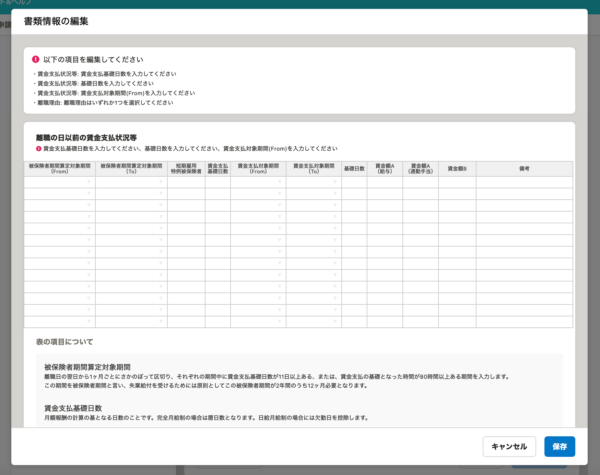
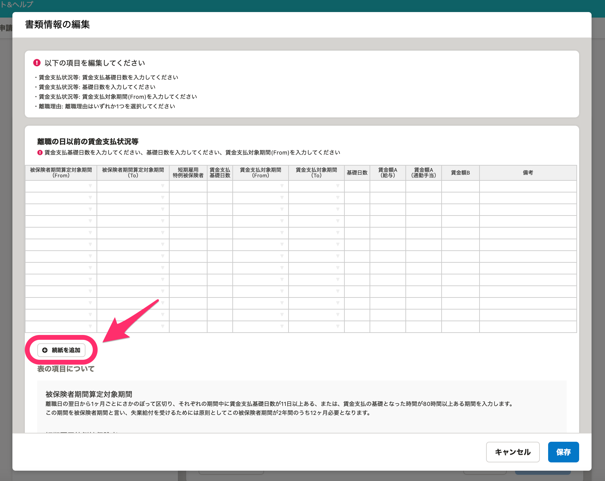
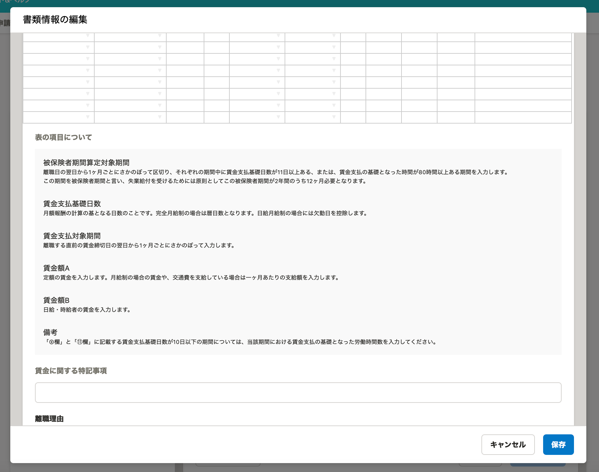
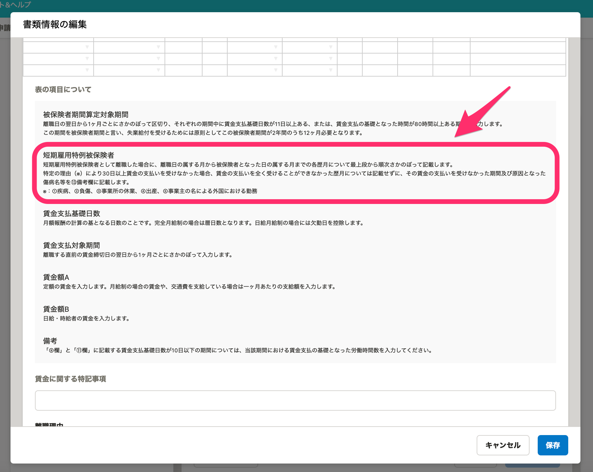

2021年3月29日（月）に行なったアップデートの詳細をお知らせします。

届出書類機能の変更点は、新機能1件・カイゼン1件・不具合修正1件でした。

# ✨ 新機能

## 「雇用保険 被保険者離職証明書」に続紙を追加できるようにしました

「雇用保険 被保険者離職証明書」の編集画面から続紙を追加できるようにしました。

| 変更前 |  |
| --- | --- |
| 変更後 |  |

# 📈 カイゼン

## 「雇用保険 被保険者離職証明書」に［短期雇用特例被保険者］の注釈を追加しました

「雇用保険 被保険者離職証明書」の編集画面 > **［表の項目について］** に **［短期雇用特例被保険者］** の注釈を追加しました。

| 変更前 |  |
| --- | --- |
| 変更後 |  |

# 👨‍⚕️ 不具合修正

「雇用保険 被保険者離職証明書」の **［賃金支払状況等］** の数値入力に関する1件の不具合修正を行ないました。
