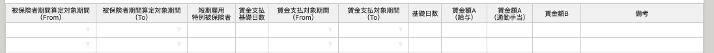
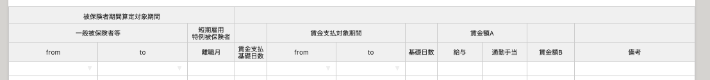
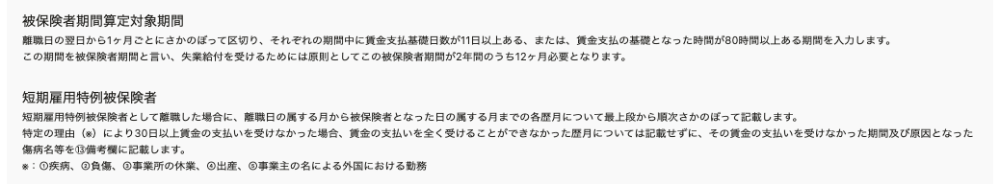
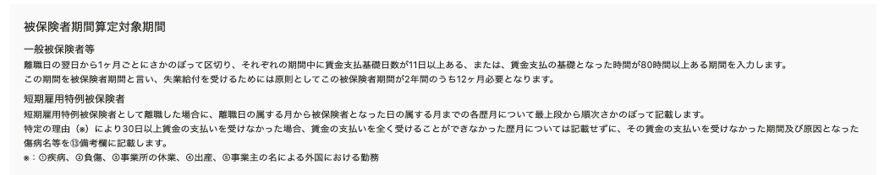

2021年4月5日（月）に行なったアップデートの詳細をお知らせします。

届出書類機能の変更点は、カイゼン1件でした。

# 📈 カイゼン

## 「雇用保険 被保険者離職証明書」の［離職の日以前の賃金支払状況等］の表を調整しました

「雇用保険 被保険者離職証明書」の **［離職の日以前の賃金支払状況等］** の表にある **［**  **短期雇用特例被保険者］** の項目も **［被保険者期間算定対象期間］** であるため、各項目の親子関係をわかりやすくしました。

また、 **［表の項目について］** の注釈も表に合わせた表記にしました。

-  **［離職の日以前の賃金支払状況等］** の表

| 変更前 |  |
| --- | --- |
| 変更後 |  |

-  **［表の項目について］** 

| 変更前 |  |
| --- | --- |
| 変更後 |  |
