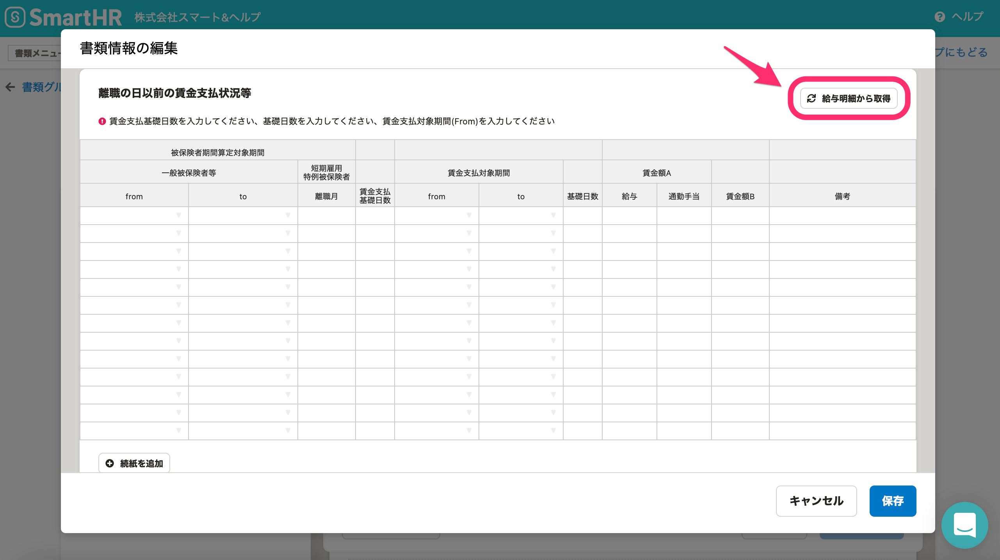

2021年4月8日（火）に行なったアップデートの詳細をお知らせします。

届出書類機能の変更点は、新機能1件でした。

# ✨ 新機能

## 「雇用保険 被保険者離職証明書」の［離職の日以前の賃金支払状況等］からSmartHRの給与明細を取り込めるようにしました

「雇用保険 被保険者離職証明書」の **［離職の日以前の賃金支払状況等］** の画面から給与明細情報を取り込めるようにしました。

 **［給与明細から取得］** をクリックすると、SmartHRに登録されている給与明細データが取り込まれます。

