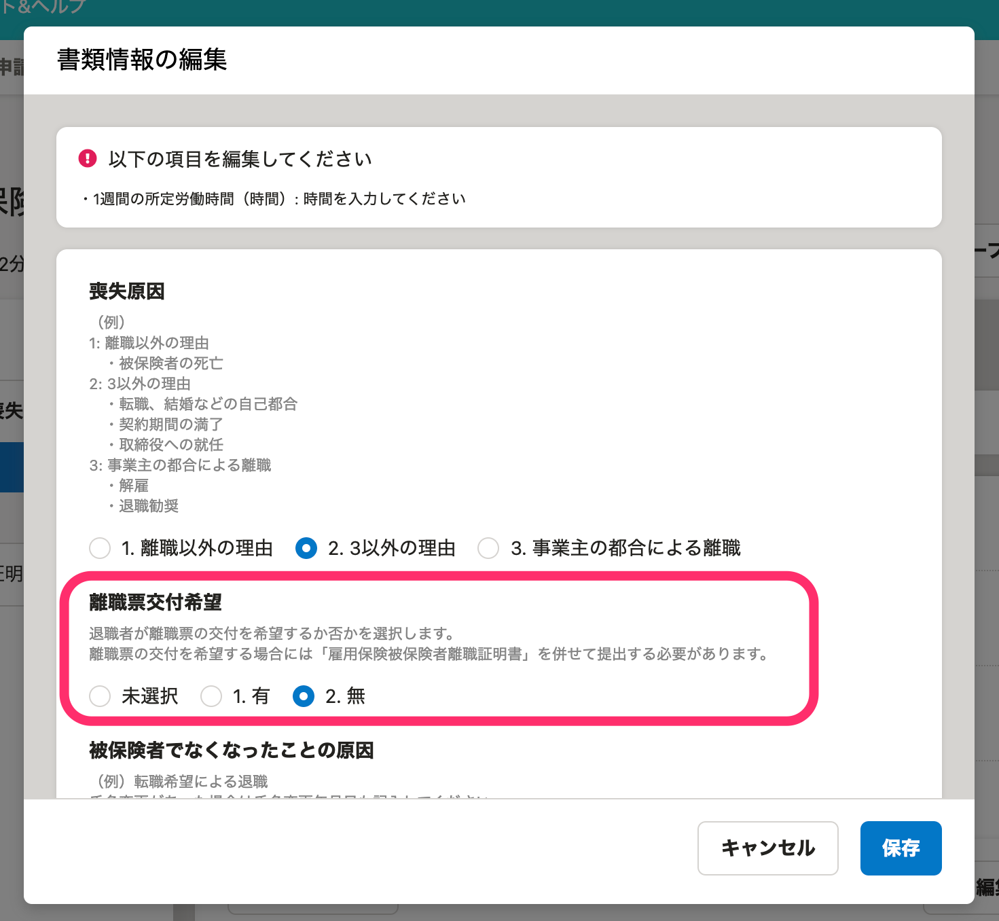
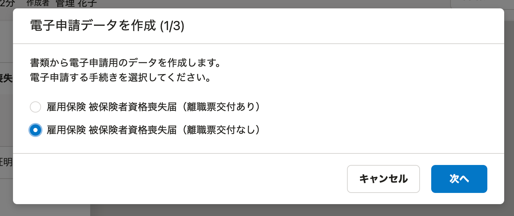
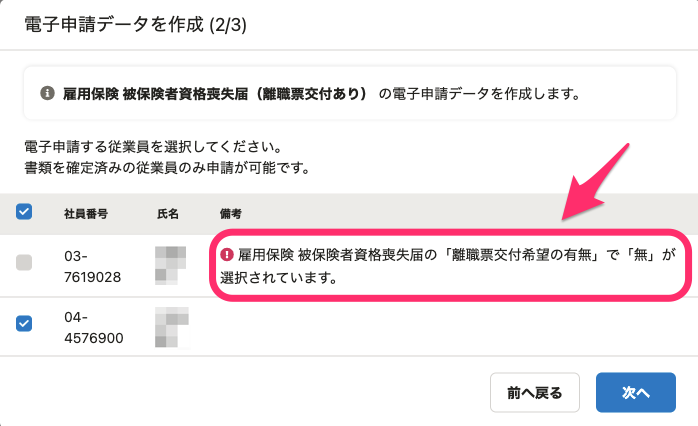

2021年4月9日（金）に行なったアップデートの詳細をお知らせします。

届出書類機能の変更点は、カイゼン1件でした。

# 📈 カイゼン

## 「雇用保険 被保険者資格喪失届」の［離職票交付希望］と電子申請の種類が合わない場合は対象従業員として選択できないようにしました

「雇用保険 被保険者資格喪失届」の書類に記載された **［離職票交付希望］** の有無と、「雇用保険 被保険者資格喪失届」を電子申請する際の **［雇用保険 被保険者資格喪失届（離職票交付あり）］／［雇用保険 被保険者資格喪失届（離職票交付なし）］** の値が合わない従業員は、電子申請作成画面で申請対象として選択できなくなりました。

**1.「雇用保険 被保険者資格喪失届」の書類に記載された［離職票交付希望］の有無**

 **2.「雇用保険 被保険者資格喪失届」を電子申請する際の［離職票交付あり］［離職票交付なし］** 

上図の1と2での選択の整合性が取れない従業員は、チェックボックスにチェックが付けられません。

