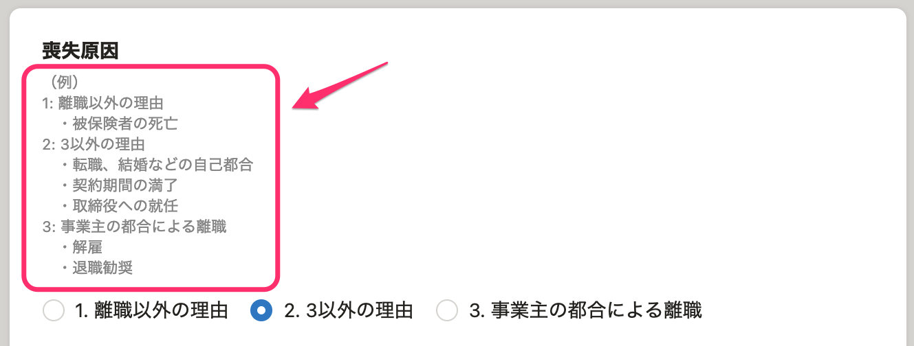
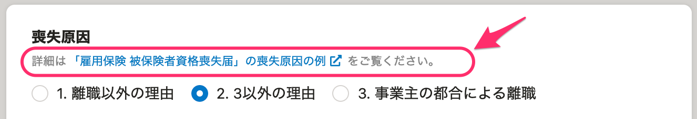

2021年4月14日（水）に行なったアップデートの詳細をお知らせします。

届出書類機能の変更点は、カイゼン2件・不具合修正2件でした。

# 📈 カイゼン

## 「雇用保険 被保険者資格喪失届」の［喪失原因］の説明文をヘルプページのリンクに置き換えました

「雇用保険 被保険者資格喪失届」の編集画面にある **［喪失原因］** の説明文が長かったため、ヘルプページの[【一覧】「雇用保険 被保険者資格喪失届」の喪失原因の例](https://knowledge.smarthr.jp/hc/ja/articles/1500002927742)のリンクに置き換えて確認しやすくしました。

| 変更前 |  |
| --- | --- |
| 変更後 |  |

## 電子申請の提出年月日を実際の送信日時にしました

これまでは電子申請の「提出年月日」は、 **［書類提出日］** が入力されていれば入力値が反映され、空欄の場合は、実際の送信日で申請されていました。

しかしこの仕様だと、連記式の場合は従業員ごとに **［書類提出日］** があるなどわかにくい場合があるため、今回の改修で、すべての電子申請の「提出年月日」を**実際に電子申請を送信した日**に統一しました。

今後は **［書類提出日］** はPDF用の項目とし、電子申請では反映されません。

# 👨‍⚕️ 不具合修正

 **［離職の日以前の賃金支払状況等］** の注釈と表の文言に関する修正など、2件の不具合修正を行ないました。
