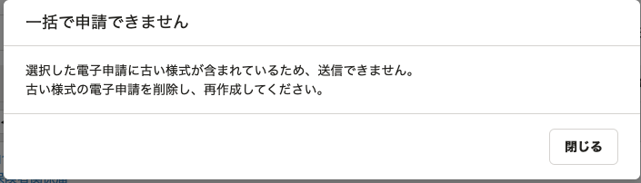

2021年4月19日（月）に行なったアップデートの詳細をお知らせします。

届出書類機能の変更点は、カイゼン1件でした。

# 📈 カイゼン

## 古い様式の電子申請を送信できないようにしました

e-Govが現在対応していない古い様式の電子申請は、下図のとおり注釈を追記し書類を送信できないようにしました。

対応書類は、「雇用保険 被保険者資格取得届」と「\[扶養追加\] 健康保険 被扶養者（異動）届・国民年金第3号被保険者関係届」です。

- **電子申請一覧の備考欄**

- **電子申請詳細画面下**

****

- **電子申請一覧で複数選択した際のダイアログ**

****
