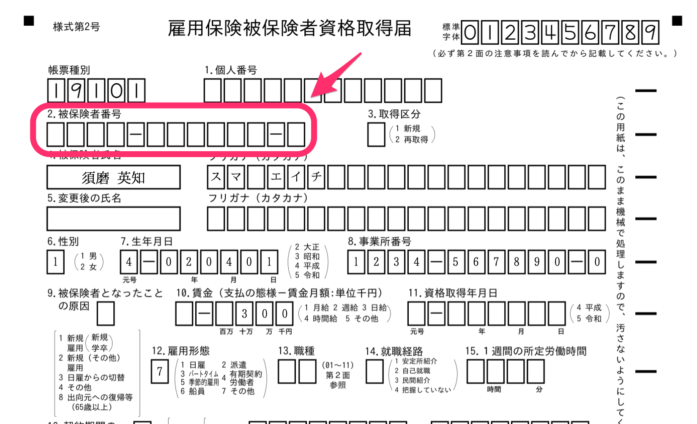

2021年4月22日（木）に行なったアップデートの詳細をお知らせします。

届出書類機能の変更点は、カイゼン1件でした。

# 📈 カイゼン

## 「雇用保険 被保険者資格取得届」の［雇用保険 被保険者番号］に関する判定条件を見直しました

「雇用保険 被保険者資格取得届」で下記2つの条件を含んだ書類の場合は、エラーにならずにPDF書類と電子申請が作成されるようにしました。

SmartHR基本機能の挙動にそろえています。

-  **［取得区分］** で **［1. 新規］** を選択
- 従業員情報の **［雇用保険 被保険者番号］** が **［9999-999999-9］** （［雇用保険 被保険者番号］が不明な場合のダミー数字）

 **「雇用保険 被保険者資格取得届」の編集**  **［取得区分］：**  **［1. 新規］** 

 **従業員情報の［雇用保険 被保険者番号］** ： **［9999-999999-9］** 

 **「雇用保険 被保険者資格取得届」PDFプレビュー画面** 

