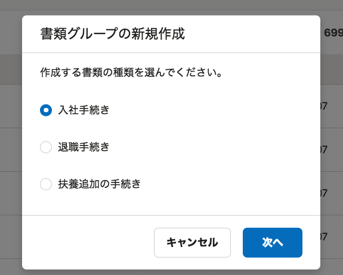
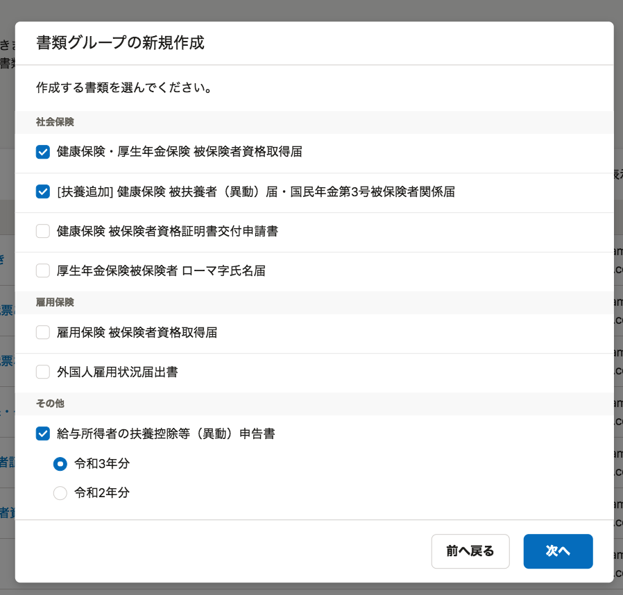
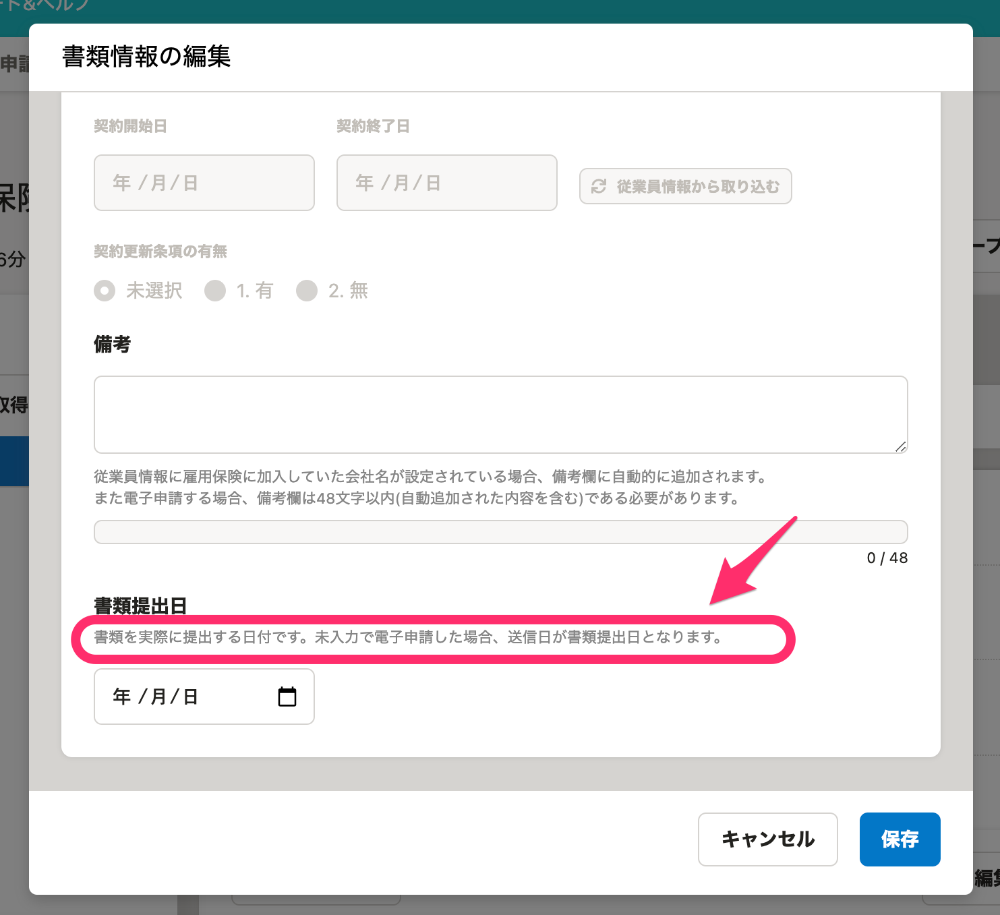
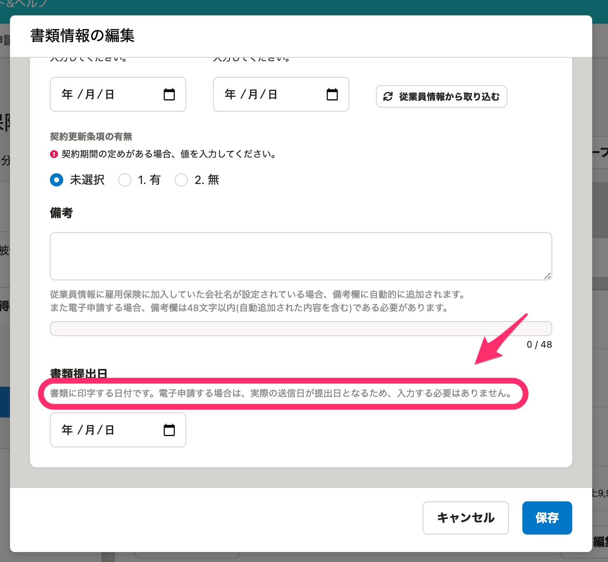

2021年5月7日（金）に行なったアップデートの詳細をお知らせします。

届出書類機能の変更点は、新機能1件・カイゼン1件・不具合修正1件でした。

# ✨ 新機能

## 書類作成の際、書類の用途をはじめに選択するようにしました

書類を作成する際、書類の用途をはじめに選択するようにしました。

分類を選択したあとは、その分類内の書類一覧から作成したい書類を選択できます。

例： **［入社手続き］** を選択した場合

# 📈 カイゼン

## ［書類提出日］の説明文を変更しました

これまでは **［書類提出日］** の説明文が、「提出日」と「送信日」の仕様変更を反映していない内容だったため、 **［書類に印字する日付です。電子申請する場合は、実際の送信日が提出日となるため、入力する必要はありません。］** に変更し、現在の仕様を反映した内容にしました。

| 変更前 |  |
| --- | --- |
| 変更後 |  |

# 👨‍⚕️ 不具合修正

「健康保険 被保険者証回収不能届」の **［備考］** の入力値の判定基準に関する1件の不具合修正を行ないました。
