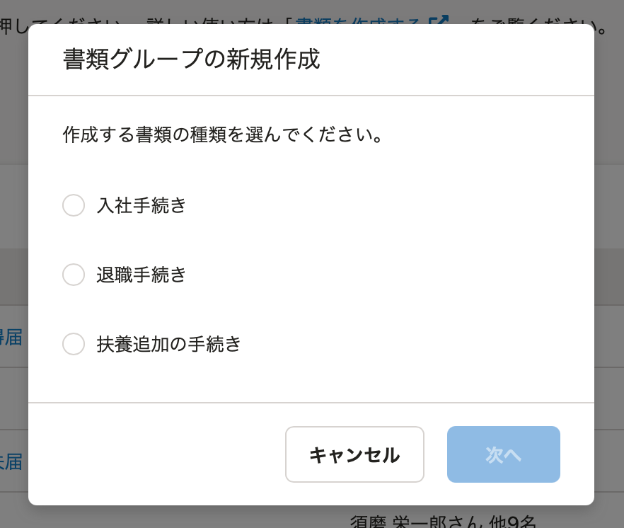
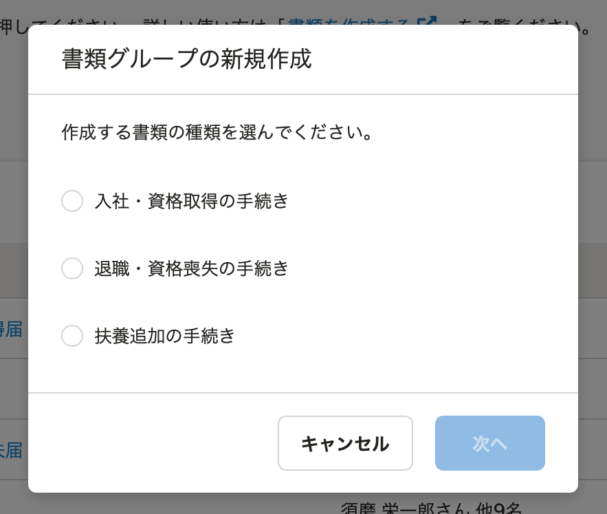

2021年5月12日（水）に行なったアップデートの詳細をお知らせします。

届出書類機能の変更点は、カイゼン1件でした。

# 📈 カイゼン

## 書類を作成する際の分類名を変更しました

書類を作成する際に最初に選択する分類の名称を下図のとおり変更しました。

:::related
[2021-05-07-書類作成の際-書類用途から選択するようにしました-他2件](https://knowledge.smarthr.jp/hc/ja/articles/900006030306)
:::

| 変更前 | 変更後 |
| --- | --- |
|  |  |
