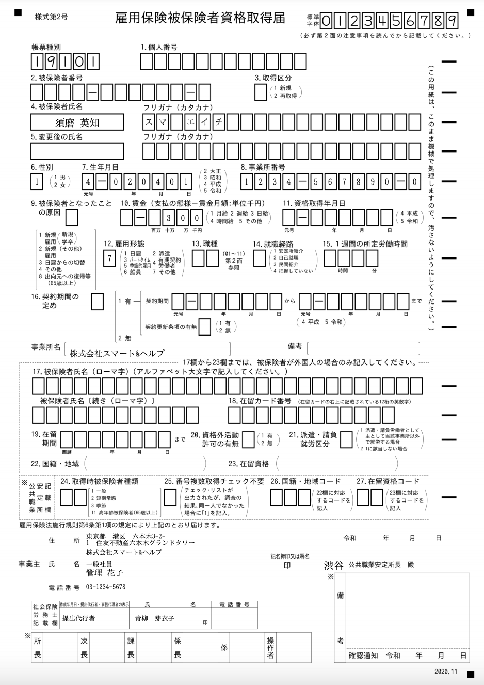
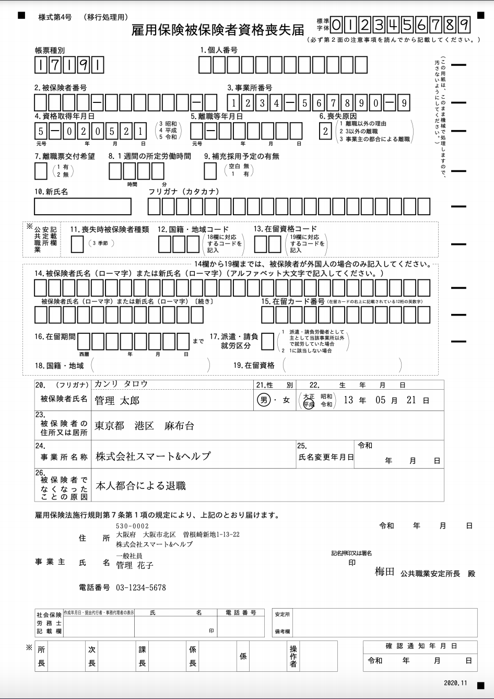

2021年5月13日（木）に行なったアップデートの詳細をお知らせします。

届出書類機能の変更点は、新機能2件でした。

# ✨ 新機能

## 「雇用保険 被保険者資格取得届」の新様式に対応しました

「雇用保険 被保険者資格取得届」に様式IDの変更や項目の追加があったため、新しい様式に対応しました。

旧様式の電子申請は 5月31日以降送信できなくなります。

## 「雇用保険 被保険者資格喪失届」電子申請の新様式に対応しました

「雇用保険被保険者資格喪失届」に様式IDの変更や項目の追加があったため、新しい様式に対応しました。

旧様式の電子申請は 5月31日以降送信できなくなります。

