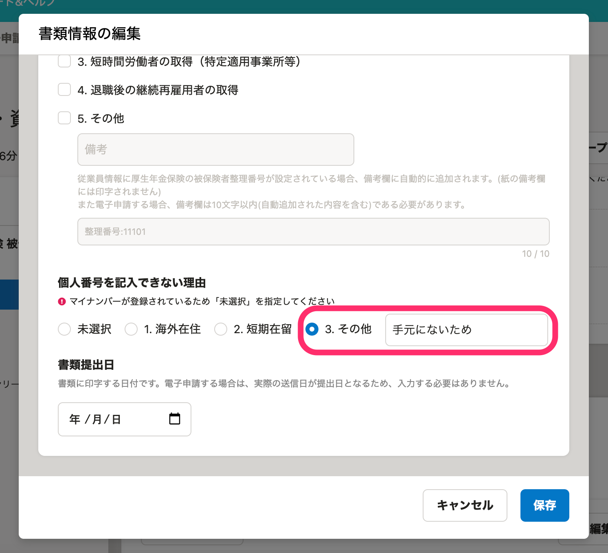
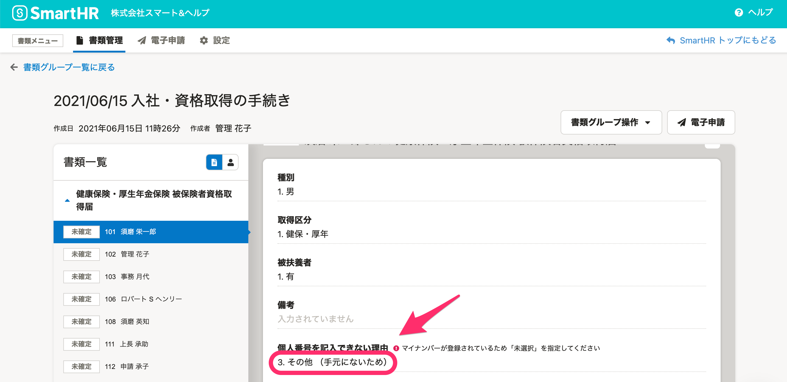
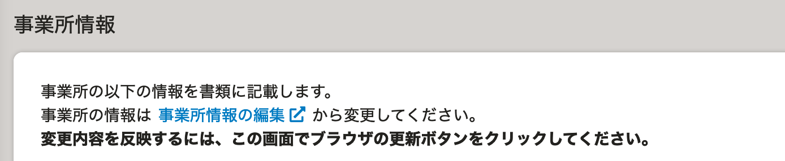
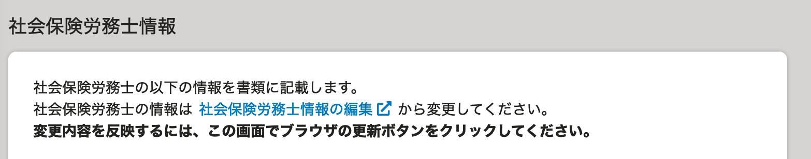
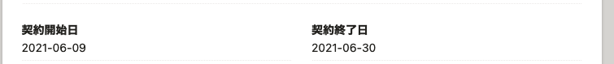
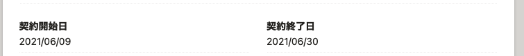

2021年6月14日（月）に行なったアップデートの詳細をお知らせします。

届出書類機能の変更点は、カイゼン3件でした。

# 📈 カイゼン

## ［その他］のコメントを（）で囲むようにしました

書類情報の編集をする際に、選択肢に **［その他］** がある項目で **［その他］** を選んでコメントを入力した場合、書類情報の詳細画面ではコメント部分を「 **（）** 」で囲むようにしました。

**書類情報の編集画面**

**書類情報の詳細画面**

## ［事業所情報］［社労保険労務士情報］の説明書きを統一しました

 **［事業所情報］［社労保険労務士情報］** の説明文が画面によって異なっていたため、説明書きをそろえました。

| 事業所情報 |  |
| --- | --- |
| 社会保険労務士情報 |  |

## 「雇用保険 被保険者資格取得届」の日付のフォーマットを他の書類と合わせました

「雇用保険 被保険者資格取得届」の日付の表記が「YYYY-MM-DD」になっている箇所があったため、他の書類と合わせて「YYYY/MM/DD」の表記に変更しました。

| 変更前 | 変更後 |
| --- | --- |
|  |  |
