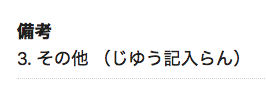
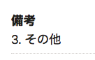

2021年6月15日（火）に行なったアップデートの詳細をお知らせします。

届出書類機能の変更点は、カイゼン1件でした。

# 📈 カイゼン

## 自由入力欄が空欄の場合は「（）」を表示しないようにしました

書類情報の編集をする際に、選択肢 **［その他］** の自由記入欄にコメントを入力した場合は、書類情報の詳細画面では入力内容を「 **（）** 」で囲むようにしましたが、入力がない場合はカッコ無しで表示するようにしました。

| 入力ありの場合 | 入力なしの場合 |
| --- | --- |
|  |  |
