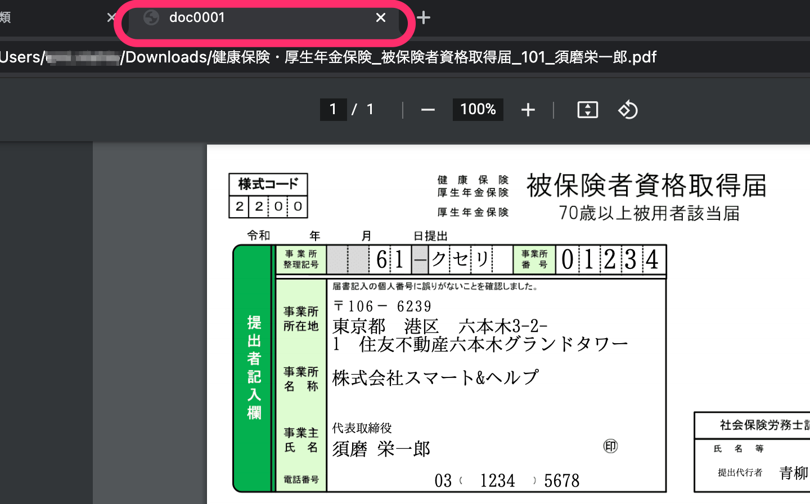
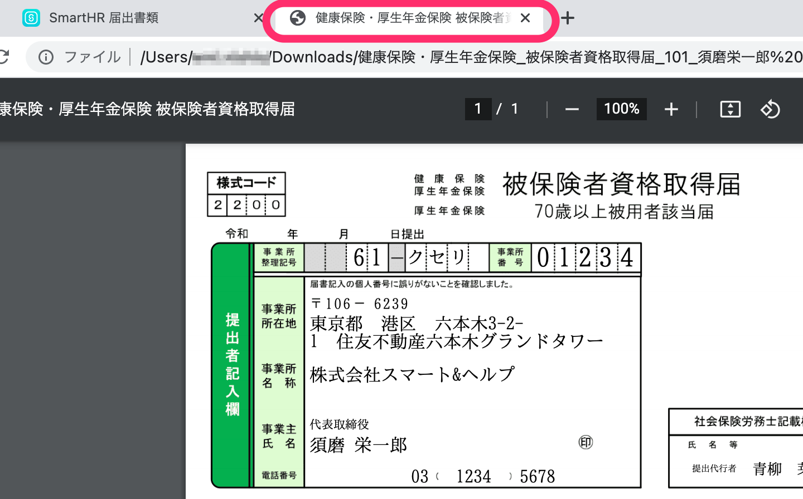

2021年6月23日（水）に行なったアップデートの詳細をお知らせします。

届出書類機能の変更点は、カイゼン1件でした。

# 📈 カイゼン

## PDFファイルの書類名とタブのタイトル名を合わせました

書類のプレビューでPDFファイルをブラウザで開いた際、書類名とタブのタイトル名が異なっていました。

そのため、書類名をタブのタイトルに表示するようにカイゼンしました。

| 変更前 | 変更後 |
| --- | --- |
|  |  |
