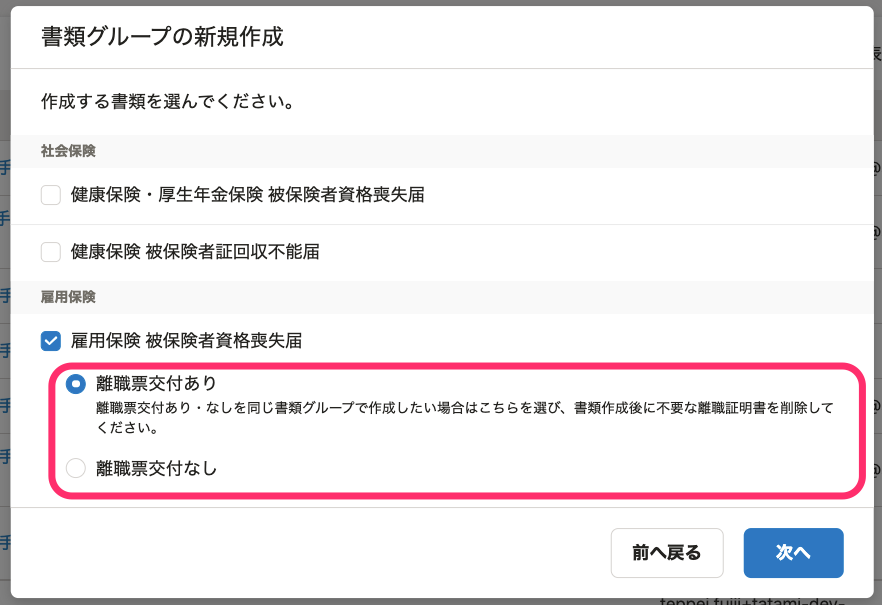

2021年7月5日（月）に行なったアップデートの詳細をお知らせします。

届出書類機能の変更点は、カイゼン1件でした。

# 📈 カイゼン

## 「雇用保険 被保険者資格喪失届」で、離職票あり・なしを同じ書類グループで作成できることを明示しました

「雇用保険 被保険者資格喪失届」を作成する際に、 **［離職票あり］** か **［離職票なし］** の1つを選択する形式のため、離職票あり・なしを混在して1つの書類グループで作成できることが伝わりづらいことがありました。

そのため、 **［離職票あり］** の選択肢に説明を追記し、「離職票あり・なし」を同じ書類グループで作成できることを明示しました。

あわせて、下記の文言も変更しています。

-  **［離職票あり］** → **［離職票交付あり］** に変更
-  **［離職票なし］** → **［離職票交付なし］** に変更

 **［書類グループの新規作成］>［退職・資格喪失の手続き］** から作成できます。

