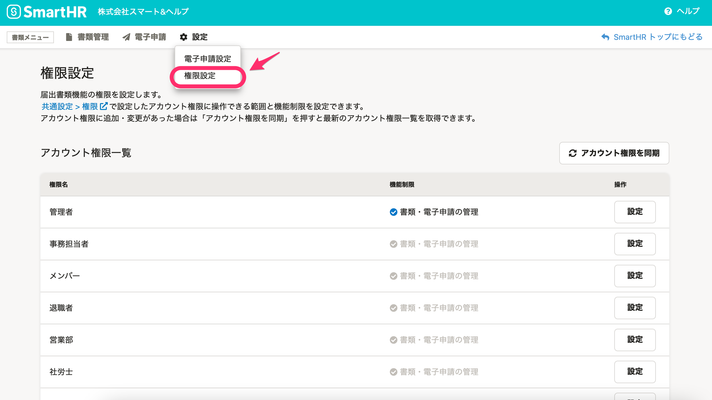
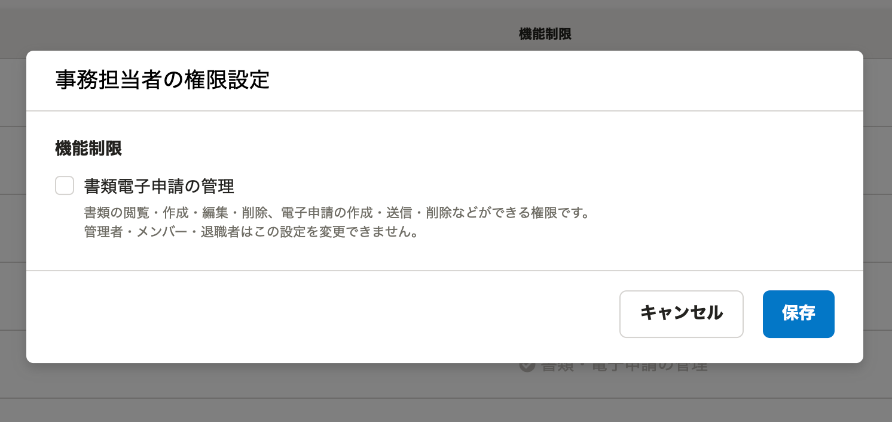

2021年7月19日（月）に行なったアップデートの詳細をお知らせします。

届出書類機能の変更点は、新機能1件でした。

# ✨ 新機能

## 届出書類機能にアクセスできる権限を管理できるようにしました

これまでは、管理者権限のみが届出書類機能にアクセスできていました。

今回のリリースで、SmartHR基本機能のアカウント権限を取り込み、権限ごとに届出書類機能へのアクセス可・不可を設定し、書類電子申請の管理をできるようにしました。

#### 注意点

- 権限の管理ページにアクセスできるのは管理者権限のみです。
- 現在は管理者権限以外の従業員が、届出書類機能へのアクセス権限を付与されても、SmartHR基本機能のメニュー欄に届出書類機能は表示されないため、URL を直接入力してアクセスします。
-  **［管理者］［メンバー］［退職者］** はデフォルト設定が決まっていて、権限の変更はできません。

 **［設定］>［権限設定］** から設定できます。

**設定画面**

