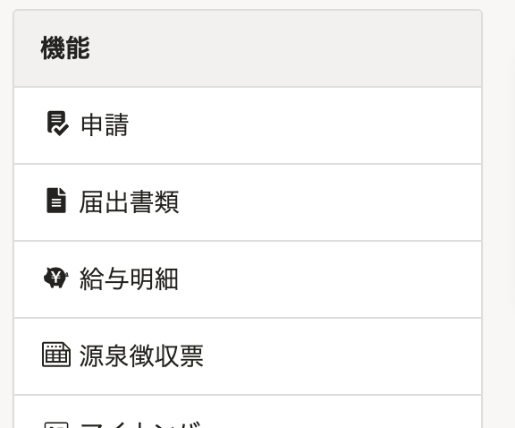
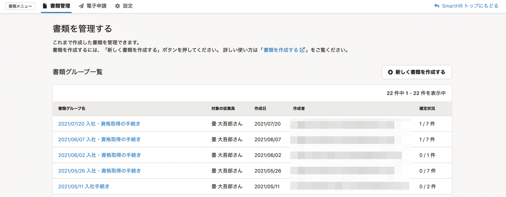
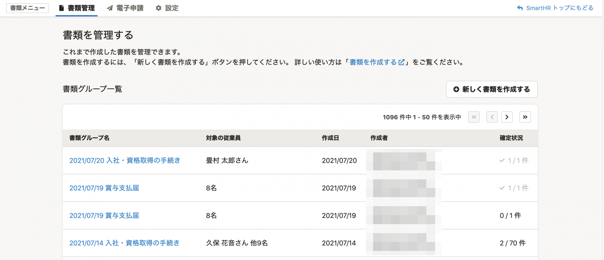
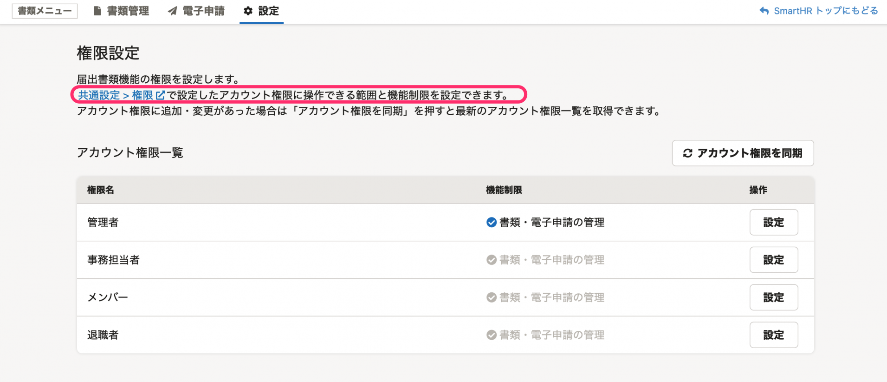
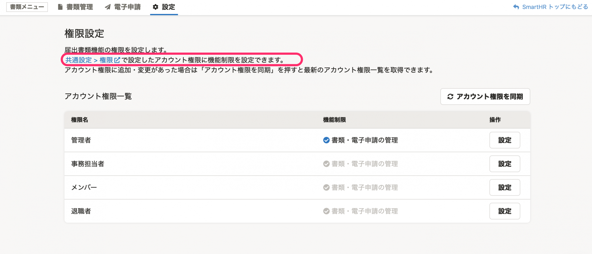
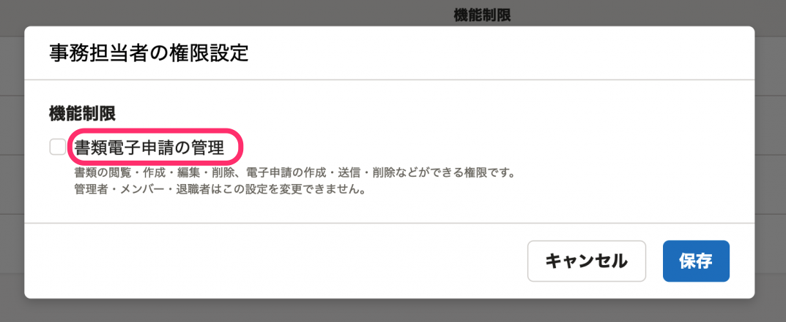
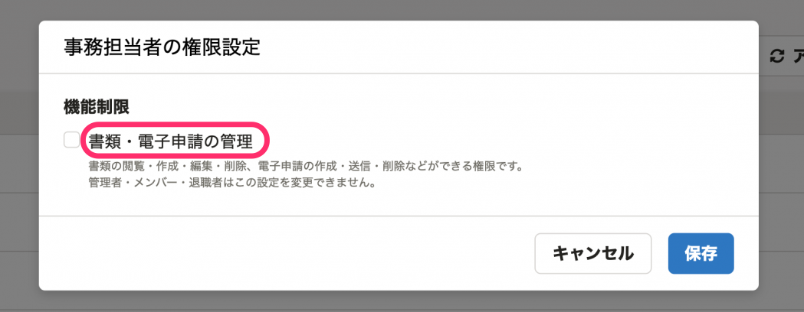
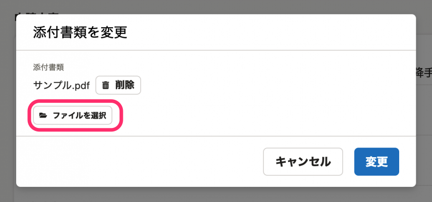
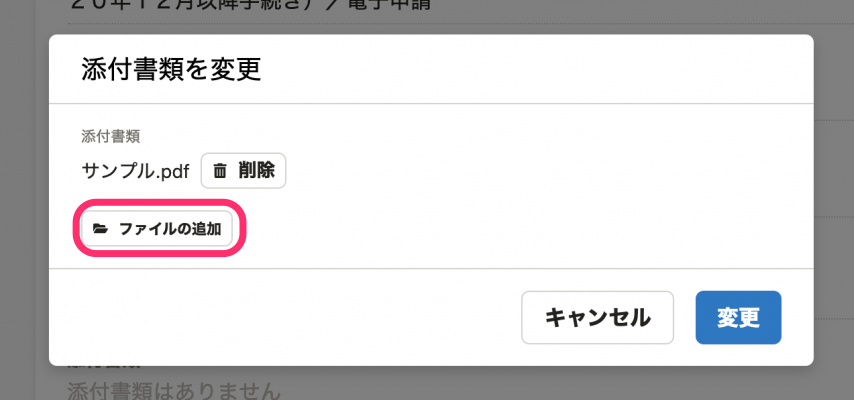

2021年7月21日（水）に行なったアップデートの詳細をお知らせします。

届出書類機能の変更点は、カイゼン3件でした。

# 📈 カイゼン

## SmartHRのトップページに届出書類機能のメニューを追加しました

これまでは管理者以外の従業員が届出書類機能にアクセスするには、URL を直接入力してアクセスしていました。

今回のリリースで、SmartHRのトップページに届出書類機能のメニューを追加し、届出書類機能に閲覧権限のある従業員が **［機能］** 欄からアクセスできるようにしました。

## フォントサイズを大きくしました

SmartHR全体のデザインにあわせて、文字の大きさを変更しました。

| 変更前 |  |
| --- | --- |
| 変更後 |  |

## 文言を変更しました

SmartHR全体の表記ルールにあわせて、下図のとおり文言を変更しました。

#### **権限設定画面**

- ［共通設定 > 権限 で設定したアカウント権限に操作できる範囲と機能制限を設定できます。］→［共通設定 > 権限 で設定したアカウント権限に機能制限を設定できます。］に変更

| 変更前 | 変更後 |
| --- | --- |
|  |  |

#### **権限設定画面 ［設定］のダイアログ内**

- ［書類電子申請の管理］→［書類・電子申請の管理］に変更

| 変更前 | 変更後 |
| --- | --- |
|  |  |

#### **電子申請詳細画面 >［添付書類を変更］のダイアログ内**

- ［ファイルを選択］→［ファイルの追加］に変更

| 変更前 | 変更後 |
| --- | --- |
|  |  |
