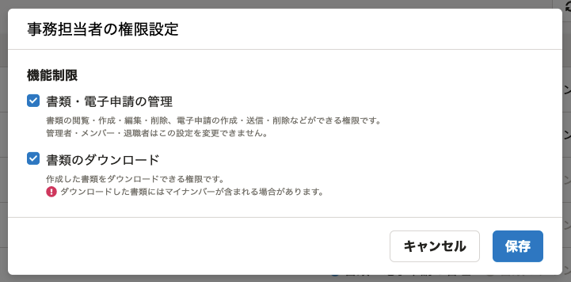

2021年7月29日（木）に行なったアップデートの詳細をお知らせします。

届出書類機能の変更点は、新機能1件でした。

# ✨ 新機能

## 書類のダウンロード権限を設定できるようにしました

作成した書類のダウンロードを、権限で制御できるようにしました。

ダウンロードした書類にマイナンバーが含まれる場合がありますが、今回のリリースにより、書類のダウンロード権限を持つ限られた従業員のみがマイナンバーを確認できるようになりました。

また、 **［書類のダウンロード］** のチェック欄に、 **［ダウンロードした書類にはマイナンバーが含まれる場合があります。］** という文言を入れ、注意喚起しています。

書類のダウンロード権限は、 **［設定］>［権限設定］** から設定できます。

書類のダウンロード権限がない従業員が書類PDFをダウンロードしようとした場合、以下のダイアログが表示されます。

