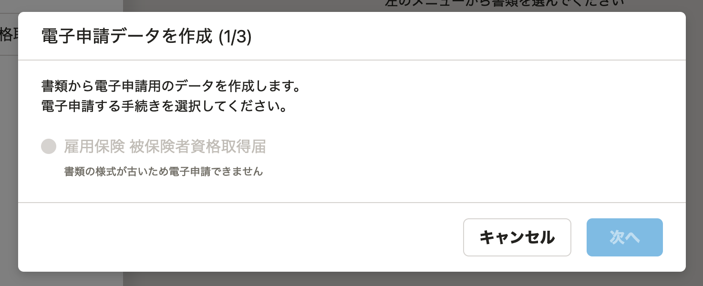

2021年7月30日（金）に行なったアップデートの詳細をお知らせします。

届出書類機能の変更点は、カイゼン1件でした。

# 📈 カイゼン

## 古い様式の「雇用保険 被保険者資格取得届」から電子申請を作成できないようにしました

「雇用保険 被保険者資格取得届」の新様式に対応したため、古い様式から電子申請を作成できないようにしました。

古い様式で **［電子申請］** をクリックすると、下図のダイアログが表示され、書類名にチェックが入りません。

:::related
[2021/05/13 「雇用保険 被保険者資格取得届」の新様式に対応しました 他1件](https://knowledge.smarthr.jp/hc/ja/articles/900006124206)
:::
