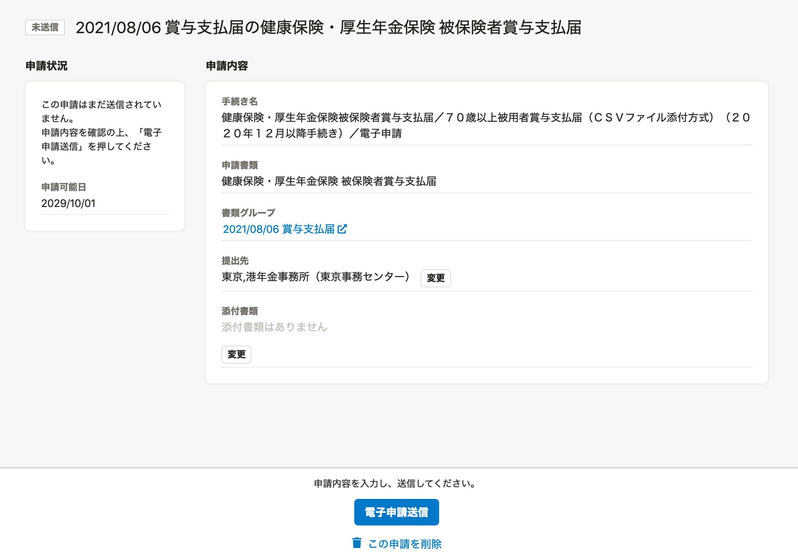

2021年8月5日（木）に行なったアップデートの詳細をお知らせします。

届出書類機能の変更点は、新機能1件・不具合修正1件でした。

# ✨ 新機能

## 「健康保険・厚生年金保険 被保険者賞与支払届」の書類・電子申請に対応しました

届出書類機能で新たに「健康保険・厚生年金保険 被保険者賞与支払届」の作成に対応しました。

また、「健康保険・厚生年金保険 被保険者賞与支払届」 の電子申請にも対応しました。

これまでSmartHRでは、給与明細機能に登録されている情報をもとに「賞与支払届」を作成していました。

今回の届出書類では、給与ソフトで作成されるCSVデータを取り込んで「賞与支払届」を作成します。

※ 届出書類で「賞与支払届」を作成する場合、給与明細機能で登録された情報は参照しません。

# 👨‍⚕️ 不具合修正

画面の表示に関する1件の不具合修正を行ないました。
