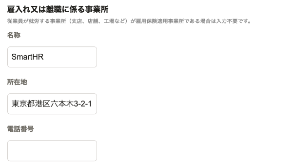
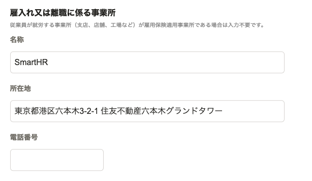

2021年8月25日（水）に行なったアップデートの詳細をお知らせします。

届出書類機能の変更点は、カイゼン1件でした。

# 📈 カイゼン

## 「外国人雇用状況届出書」にある［雇入れ又は離職に係る事業所］の入力欄の幅を広げました

これまでは、「外国人雇用状況届出書」の書類情報を編集する際に、 **［雇入れ又は離職に係る事業所］** 欄にある **［名称］［所在地］** の入力欄が狭く、情報が長い場合だとカーソルを移動しないと確認できませんでした。

そのため今回の改修で、 **［名称］［所在地］** の入力欄の幅を広げ、長い情報でも表示するようにし、見やすくしました。

| 変更前 | 変更後 |
| --- | --- |
|  |  |
