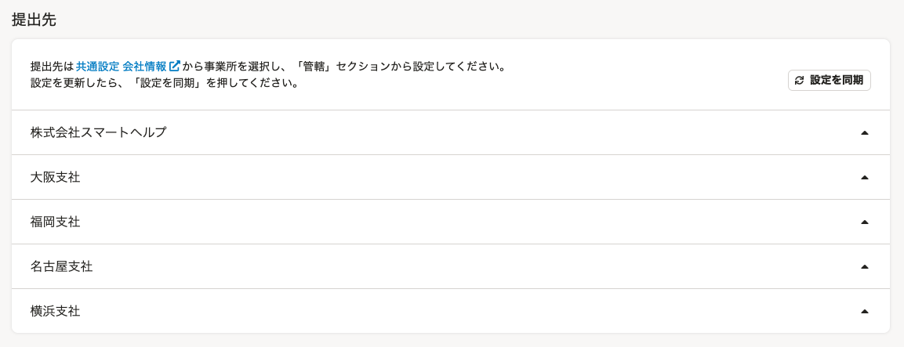
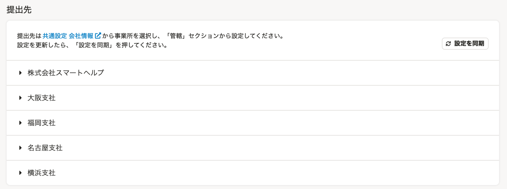
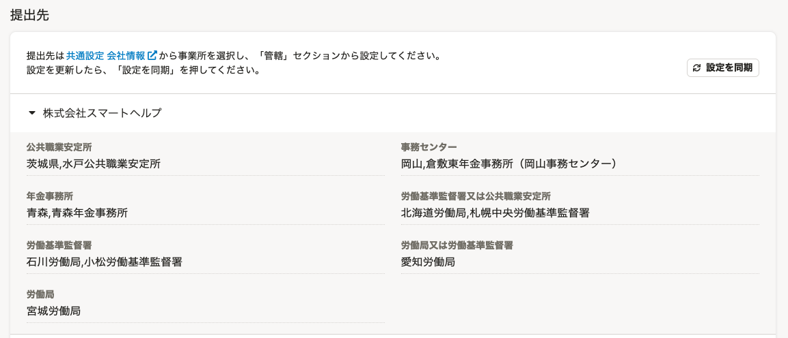

2021年9月10日（金）に行なったアップデートの詳細をお知らせします。

届出書類機能の変更点は、カイゼン1件でした。

# 📈 カイゼン

## 提出先リストの開閉デザインを変更しました

電子申請設定にある提出先リストの開閉デザインを、書類グループの **［書類一覧］** とあわせて、下図のとおり変更しました。

- 閉じた状態

| 変更前 | 変更後 |
| --- | --- |
|  |  |

- 開いた状態

| 変更前 | 変更後 |
| --- | --- |
|  |  |
