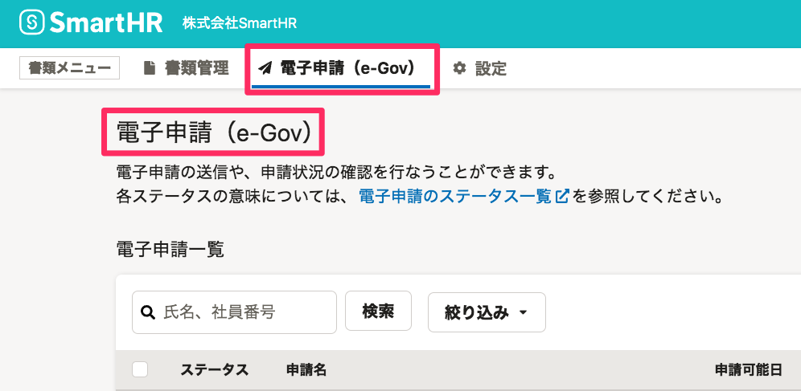

2021年10月27日（水）に行なったアップデートの詳細をお知らせします。

届出書類機能の変更点は、カイゼン1件でした。

# 📈 カイゼン

## 電子申請機能の名称を変更しました

現行のe-Gov経由での電子申請と今後対応を予定しているマイナポータル経由での電子申請とを区別するために、書類メニュー上の **\[電子申請\]** を **\[電子申請（e-Gov）\]** に変更しました。

また、あわせて電子申請一覧ページの見出しも変更しました。

