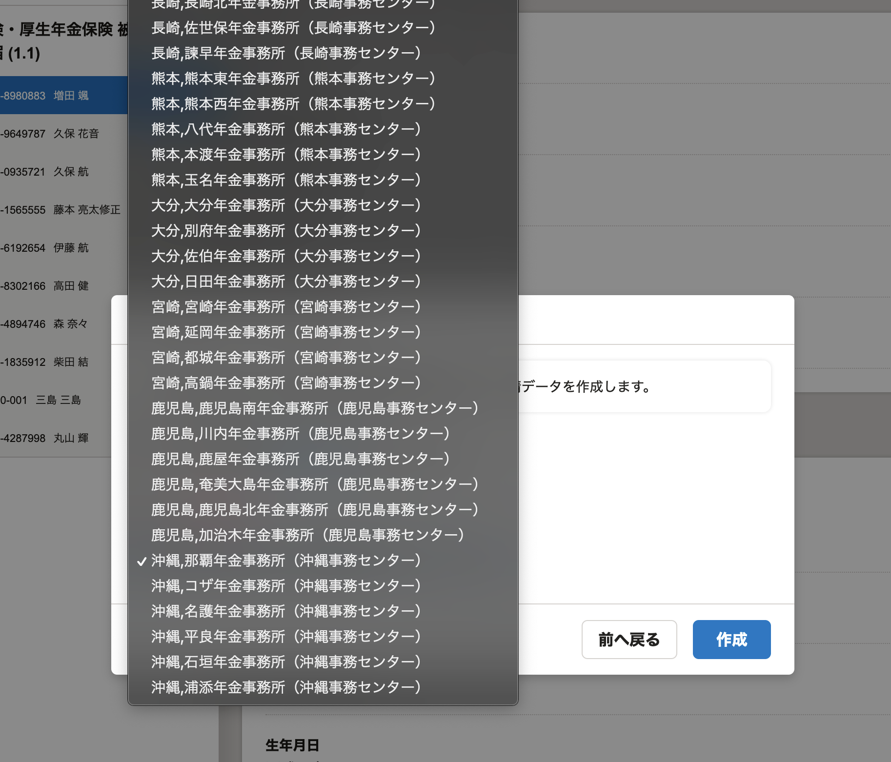
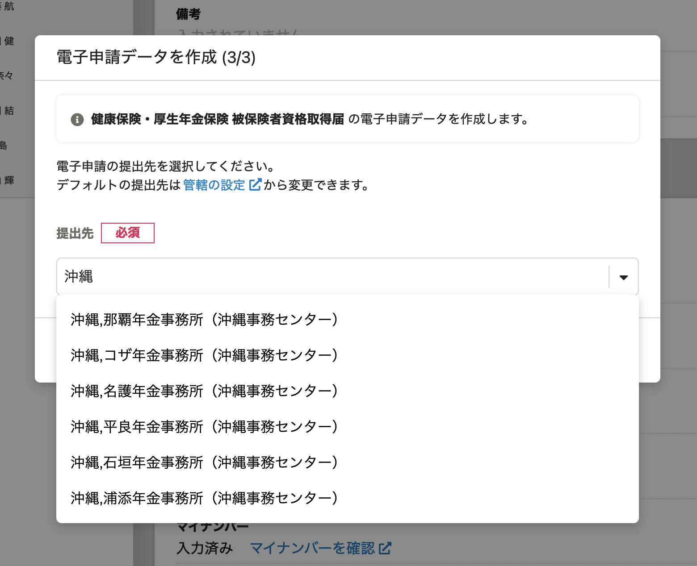

2021年11月2日（火）に行なったアップデートの詳細をお知らせします。

届出書類機能の変更点は、カイゼン1件でした。

# 📈 カイゼン

## 電子申請の提出先選択のUIを変更しました

電子申請の作成時と作成後の詳細画面にて、提出先を選択する際のUIをSmartHR UIに変更しました。

これまでは、選択肢がすべて表示されてしまい、目的の提出先が見つけづらい状態になっていました。

今回のリリースで、文字を入力して選択肢を絞り込めるようにしました。

| 変更前 | 変更後 |
| --- | --- |
|  |  |
