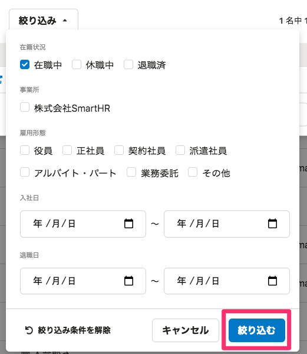
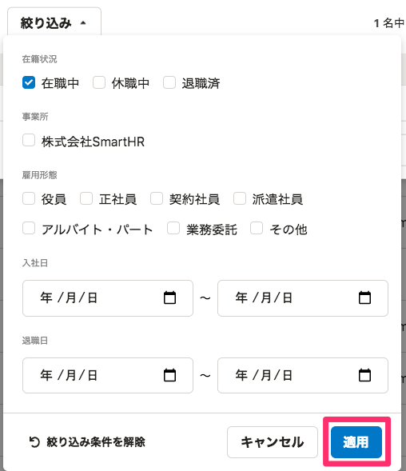

2021年12月07日（火）に行なったアップデートの詳細をお知らせします。

届出書類機能の変更点は、改善1件でした。

# 📈 改善

## 書類グループ作成画面の文言を変更しました

書類グループ作成時の従業員を選択する画面で、従業員の絞り込み条件を適用するボタンの文言を変更しました。これまでは **［絞り込む］** としていましたが、SmartHR全体の表記ルールにあわせて **［適用］** に変更しました。

| 変更前 | 変更後 |
| --- | --- |
|  |  |
