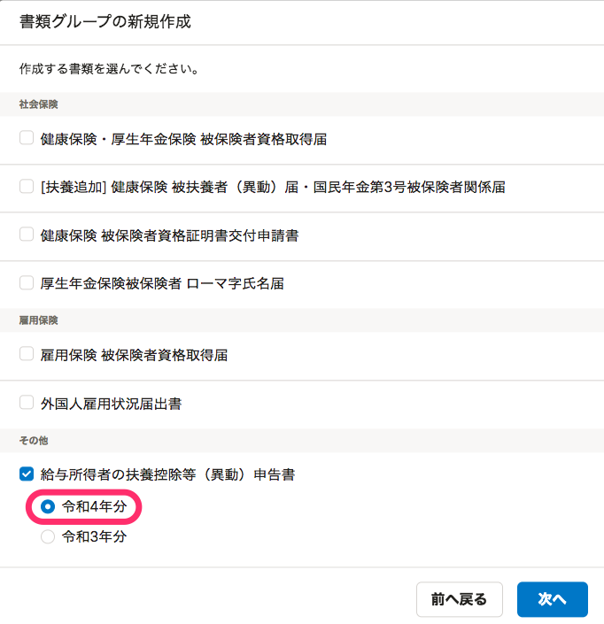
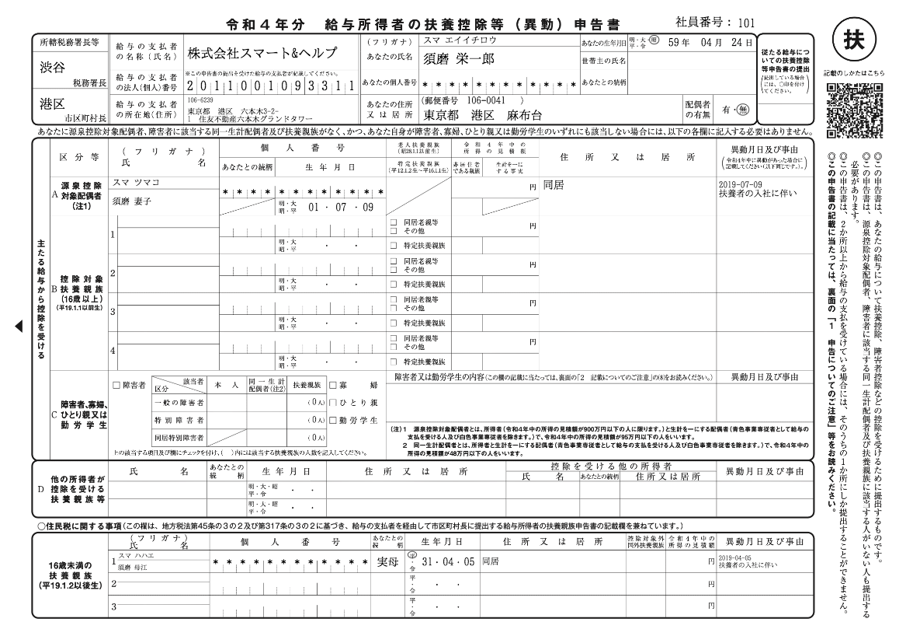

2021年12月10日（金）に行なったアップデートの詳細をお知らせします。

届出書類機能の変更点は、新機能1件でした。

# ✨ 新機能

## 「令和4年分 給与所得者の扶養控除等（異動）申告書」の作成に対応しました

届出書類機能で新たに「令和4年分 給与所得者の扶養控除等（異動）申告書」の作成に対応しました。

書類グループの新規作成から、 **［入社・資格取得の手続き］** を選択し、 **［給与所得者の扶養控除等（異動）申告書］** にチェックを入れ、 **［令和4年分］** を選択すると作成できます。

