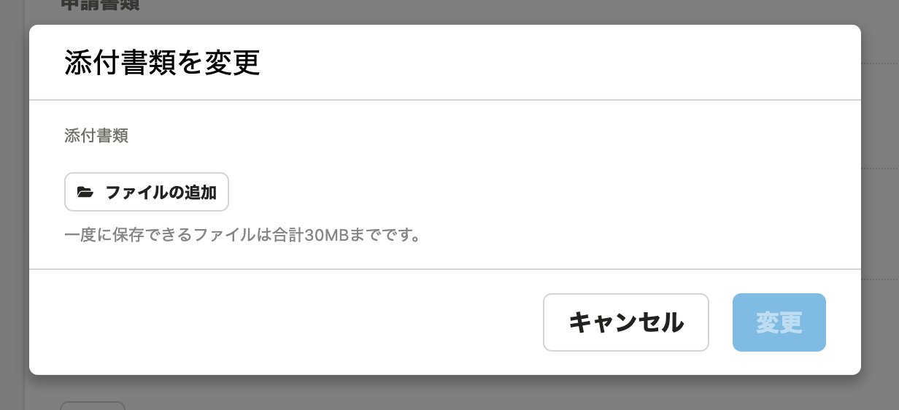
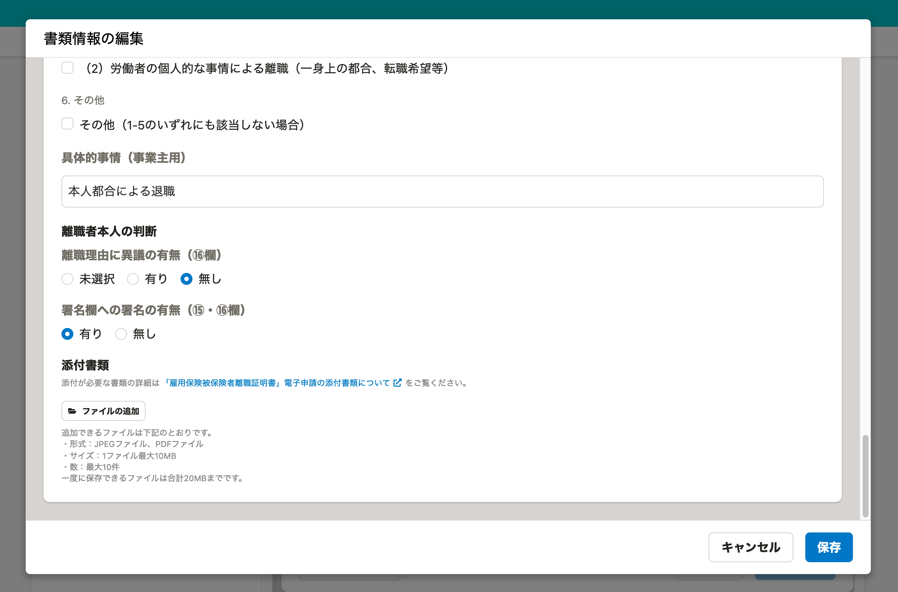

2021年12月17日（金）に行なったアップデートの詳細をお知らせします。

届出書類機能の変更点は、改善1件・不具合修正1件でした。

# 📈 改善

## ファイルを追加できるダイアログに、一度に保存できるファイルサイズを明記しました

電子申請の添付書類変更ダイアログと離職証明書の編集ダイアログに、一度に保存できるファイルサイズを明記しました。

**電子申請の添付書類変更ダイアログ**

**離職証明書の編集ダイアログ**

# 👨‍⚕️ 不具合修正

外国人雇用状況届出書を作ろうとした場合に、書類の作成条件の確認が表示されない不具合を修正しました。
