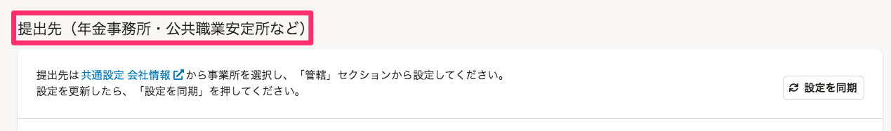

2022年1月4日（火）に行なったアップデートの詳細をお知らせします。

届出書類機能の変更点は、改善2件・不具合修正1件でした。

# 📈 改善

## 電子申請設定の提出先の見出しを変更しました

現行のe-Gov経由での電子申請と今後対応を予定しているマイナポータル経由での電子申請とで提出先を共通で利用するために、 **［e-Gov提出先］** を **［提出先（年金事務所・公共職業安定所など）］**  に変更しました。

## フォントを変更しました

フォントをSmartHR Design Systemで定義されている形式に変更しました。

[タイポグラフィ | SmartHR Design System](https://smarthr.design/products/design-tokens/typography/)

# 👨‍⚕️ 不具合修正

電子申請時の事業所整理記号に関する1件の不具合修正を行ないました。
