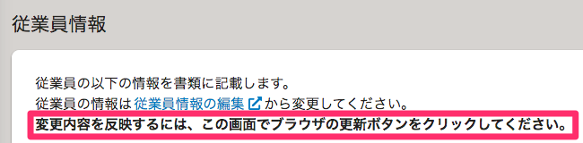
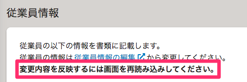

2022年1月7日（金）に行なったアップデートの詳細をお知らせします。

届出書類機能の変更点は、改善1件でした。

# 📈改善

## 書類グループ詳細画面の文言を変更しました

書類グループ詳細画面で変更内容を反映させる手順の文言を修正しました。

これまでは **［ブラウザの更新ボタンをクリックしてください］** としていましたが、SmartHR全体の表記ルールにあわせて **［画面を再読み込みしてください］** に変更しています。

| 変更前 | 変更後 |
| --- | --- |
|  |  |
