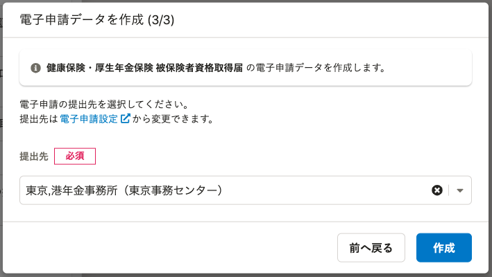
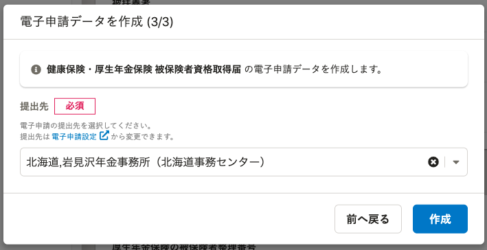
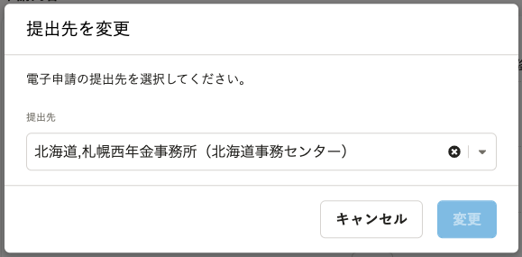
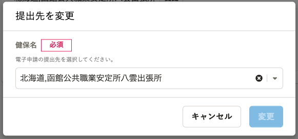

2022年1月14日（金）に行なったアップデートの詳細をお知らせします。

届出書類機能の変更点は、改善1件でした。

# 📈改善

## 一部のダイアログでヒントメッセージの表示を変更しました

電子申請に関連する一部のダイアログで、ヒントメッセージの表示位置を修正しました。

項目の直下にヒントメッセージを表示することで、どの項目についてのメッセージかわかりやすくしました。

また、必須項目にも関わらず、必須マークが入っていない項目に必須マークを表示しました。

| 変更前 | 変更後 |
| --- | --- |
|  |  |
|  |  |
