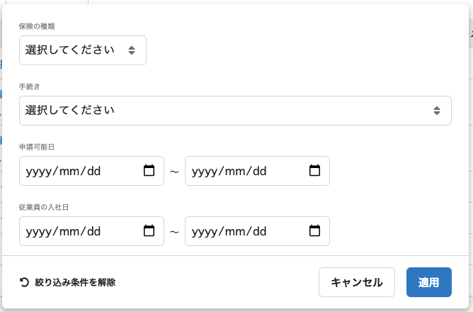
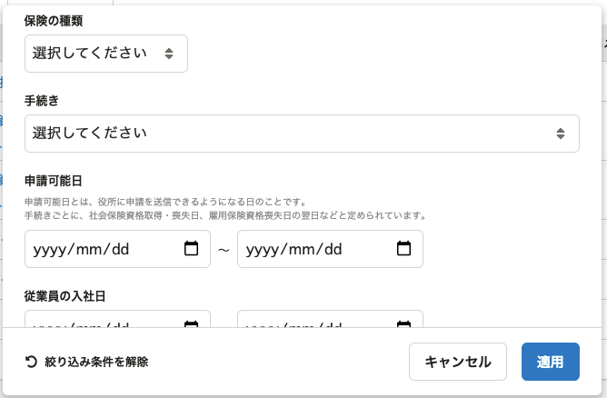

2022年1月21日（金）に行なったアップデートの詳細をお知らせします。

届出機能の変更点は、改善2件でした。

# 📈 改善

## 電子申請一覧の絞り込みダイアログの表示を改善しました

電子申請一覧の絞り込みダイアログの文字サイズ・太さを変更し見やすくしました。

また、申請可能日の説明を追加しました。

| 変更前 | 変更後 |
| --- | --- |
|  |  |

## メニューバーの名称を届出書類に変更しました

SmartHR内での文言を統一するため、メニューバーの名称を **［届出書類メニュー］** から **［届出書類］** に変更しました。

| 変更前 | 変更後 |
| --- | --- |
|  |  |
