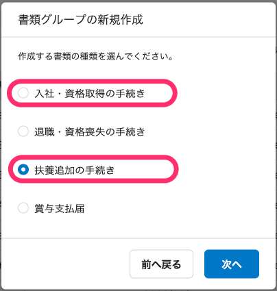
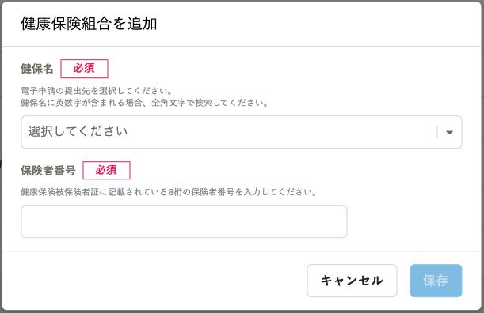

2022年3月17日（木）に行なったアップデートの詳細をお知らせします。

届出書類機能の変更点は、新機能1件でした。

# ✨ 新機能

## 組合健保に加入している事業所でも「［扶養追加］健康保険 被扶養者（異動）届・国民年金第3号被保険者関係届」を電子申請できるようにしました

これまでは「［扶養追加］健康保険 被扶養者（異動）届・国民年金第3号被保険者関係届」は協会けんぽに加入している事業所でしか電子申請できませんでした。
今回の機能追加で、組合健保に加入している事業所でもマイナポータルAPIを利用して電子申請できるようにしました。

「入社・資格取得の手続き」と「扶養追加の手続き」から選択できます。

「［扶養追加］健康保険 被扶養者（異動）届・国民年金第3号被保険者関係届」の電子申請を作成するには、事前に **［**  **設定］>［電子申請設定］>［提出先（健康保険組合）］** から、提出先の健康保険組合と保険者番号を設定してください。

