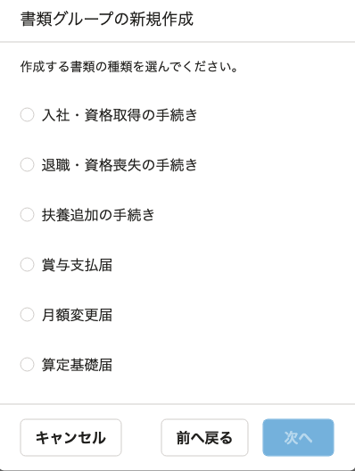

2022年6月7日（火）に行なったアップデートの詳細をお知らせします。

届出書類機能の変更点は、新機能1件でした。

# ✨ 新機能

## 「健康保険・厚生年金保険 被保険者報酬月額算定基礎届」「健康保険・厚生年金保険 被保険者報酬月額変更届」を電子申請できるようにしました

新たに「健康保険・厚生年金保険 被保険者報酬月額算定基礎届」「健康保険・厚生年金保険 被保険者報酬月額変更届」の作成に対応しました。

「月額変更届」「算定基礎届」から選択できます。

健康保険組合向けに今回対応した書類の電子申請を作成するには、事前に **［設定］>［電子申請設定］>［提出先（健康保険組合）］** から、提出先の健康保険組合と保険者番号を設定してください。

