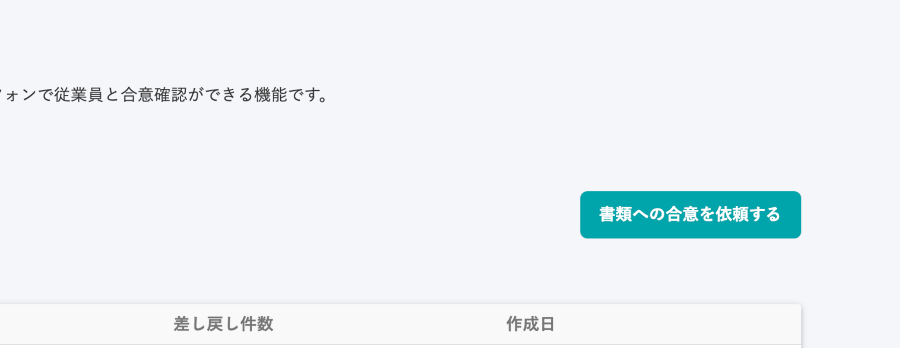
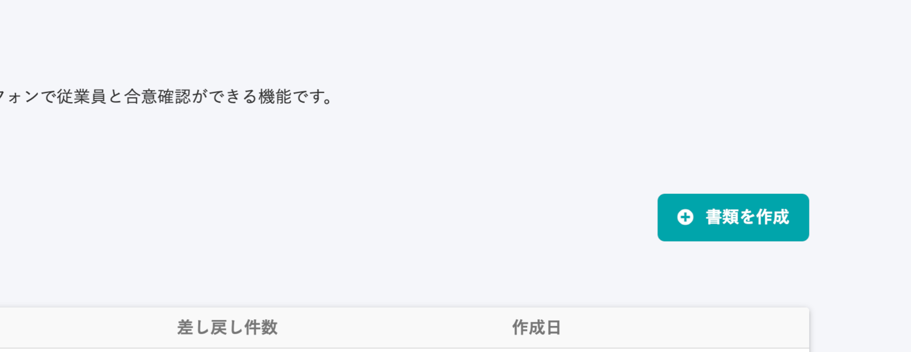

2020年9月10日（木）に行なったアップデートの詳細をお知らせします。

雇用契約機能の変更点は、カイゼン1点・不具合修正1点でした。

# 📈カイゼン

## ダッシュボードのボタンの文言を変更しました

これまで「書類への合意を依頼する」だった文言を、「書類を作成」に変更しました。

| 変更前 |  |
| --- | --- |
| 変更後 |  |

理由としては、以下の2つがあります。

- 今後、合意が要らない書類にも対応するため、「合意を依頼」という表現が不自然になるため。
- 「アクションボタンは体言止めにする」新しい文言ガイドラインに準拠するため。

他の画面も随時同様の変更を実施していく予定です。

# 👨‍⚕️不具合修正

iOSブラウザでの表示に関する1点の不具合修正を行ないました。
