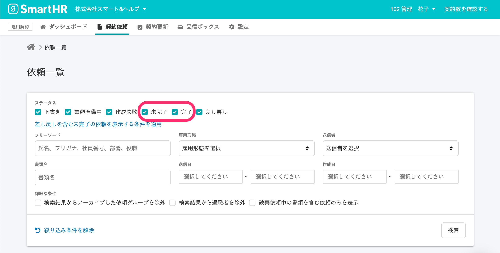

2020年9月14日（月）に行なったアップデートの詳細をお知らせします。

雇用契約機能の変更点は、カイゼン1点・不具合修正1点でした。

# 📈カイゼン

## 依頼ステータスの名称を変更しました

依頼ステータスの名称を変更し、すべての画面に反映しました。

今後の改修にともない、「合意が必要な書類」と「合意が要らない書類」が混在するようになるため、もともと使用されていた **\[合意済み\]** というステータス名を **\[未完了\]** に変更しました。

合わせて、**\[発送済み\]** というステータス名も、 **\[未完了\]** に変更しました。

いずれも名称の変更のみで、状態としては変更はありません。

依頼一覧画面

****

ダッシュボード画面****

# 👨‍⚕️不具合修正

Internet Explorer での画面表示に関する1点の不具合修正を行ないました。
