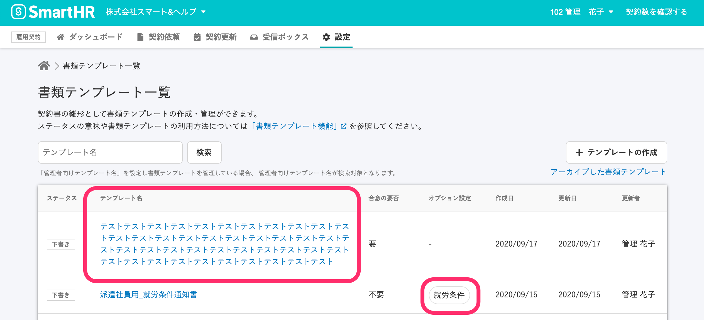

2020年9月16日（水）に行なったアップデートの詳細をお知らせします。

雇用契約機能の変更点は、カイゼン1点・不具合修正2点でした。

# 📈カイゼン

## \[書類テンプレート一覧\] の文言の変更と \[テンプレート名\] の表示の長さを調整しました

書類テンプレート一覧画面の **\[オプション設定\]** にあった、**\[就労条件に関する通知\]** を **\[就労条件\]** に変更しました。

また、テンプレート名は、どの長さになっても幅の比率を固定するように変更しました。

書類テンプレート一覧画面

# 👨‍⚕️不具合修正

ヘルプページへのリンクの修正など、2点の不具合修正を行ないました。
