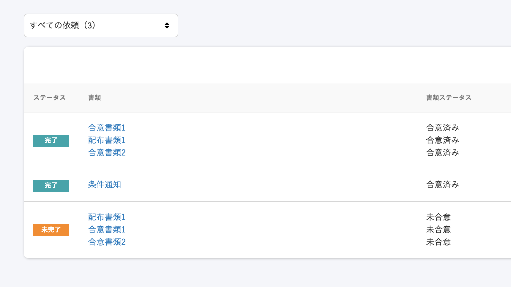
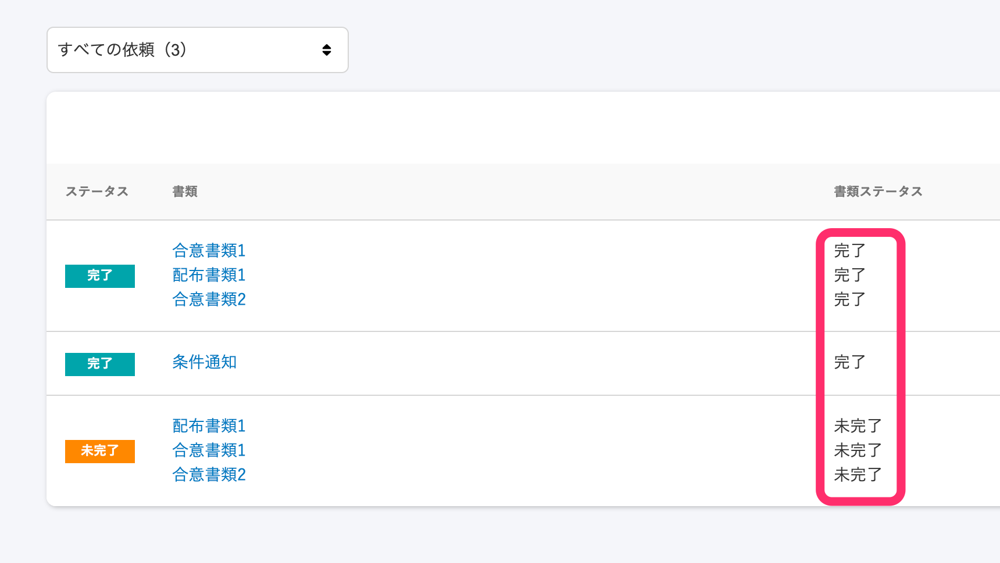

2020年9月25日（金）に行なったアップデートの詳細をお知らせします。

雇用契約機能の変更点は、カイゼン1点でした。

# 📈 カイゼン

## 書類ステータスを、合意の要否に関わらず違和感のない文言に変更しました

2020年9月末頃より、「雇用契約機能」がリニューアルされ、 “あらゆる人事文書” の配付に対応した **「文書配付機能」** の提供が始まります。

[SmartHRの雇用契約機能が、“あらゆる人事文書” の配付に対応した「文書配付機能」にリニューアル](https://smarthr.jp/release/20651)

このリニューアルにともない、「合意が必要な書類」「合意の要らない書類」が混在するようになるため、もともと使用されていた **\[合意済み\]** というステータス名を **\[完了\]**とし、**\[未合意\]** というステータス名も **\[未完了\]** に変更しました。

いずれも名称の変更のみで、状態としては変更はありません。

| 変更前 |  |
| --- | --- |
| 変更後 |  |
