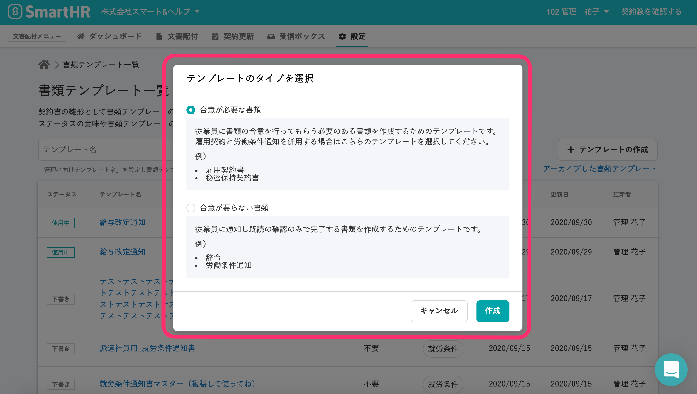
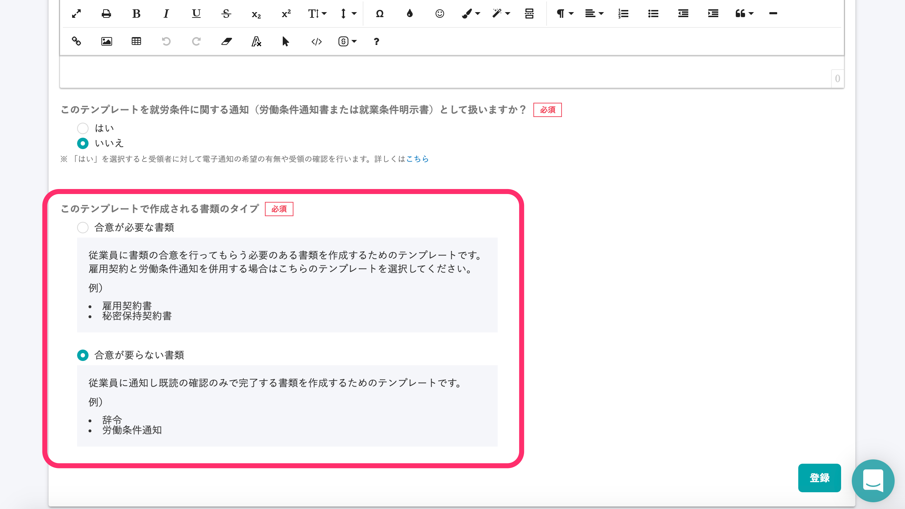
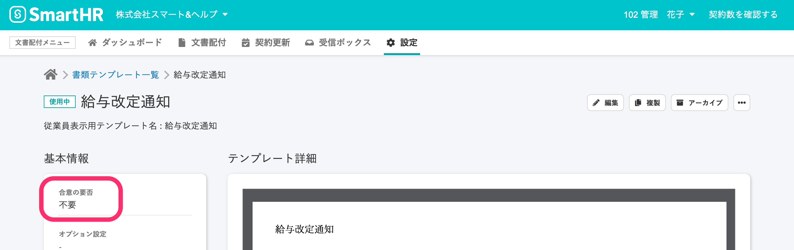
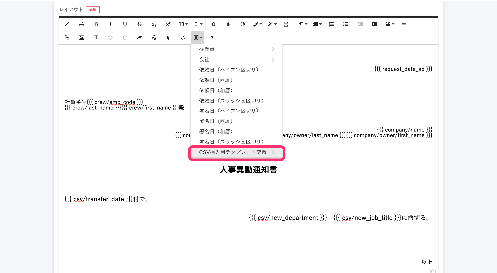
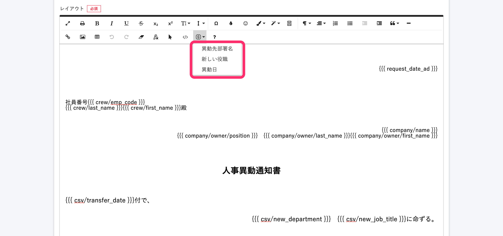

2020年9月30日（水）に行なったアップデートの詳細をお知らせします。

今回のリリースを機に、雇用契約機能は文書配付機能と名称を変更しました。

新機能は2件、不具合修正1件でした。

# ✨ 新機能

## 合意が要らない書類を作成し、従業員に配付できるようになりました

従来の「雇用契約機能」をアップデートし、 ”合意が要らない書類” を従業員に配付できる「文書配付機能」をリリースしました。

書類テンプレートが、「合意が必要な書類」（従来の書類）と「合意が要らない書類」の2種類になり、「合意が必要な書類」は合意の依頼を、「合意がいらない書類」は確認の依頼を、従業員に送れるようになりました。

実際の使用方法としては、これまでとほぼ変わらず、書類テンプレート作成時に、\[合意が必要な書類\] か、\[合意が要らない書類\] かを選択するようになりました。

書類ステータスが「下書き」の場合に限り、テンプレート編集画面でも、同様の選択が行なえます。

テンプレート詳細画面

お知らせページも合わせてご覧ください。

[SmartHRの雇用契約機能が、“あらゆる人事文書” の配付に対応した「文書配付機能」にリニューアル](https://smarthr.jp/release/20651)

[雇用契約機能において、合意不要な文書を配付できるようになります！](https://smarthr.jp/update/20601)

## SmartHRの従業員項目以外のデータを書類テンプレートに挿入できるようになりました

これまで、書類テンプレートにはSmartHRの従業員項目の従業員ごとのデータを挿入することしかできませんでしたが、CSVファイルを使って一括挿入するためのテンプレート変数 **「CSV挿入用テンプレート変数」** が利用できるようになりました。

CSV挿入用テンプレート変数の使い方は、大きく分けて2つのステップになります。

- 書類に挿入したい項目を、テンプレート変数として文書配付機能に登録する
- 依頼グループに対して、CSVファイルを一括挿入する

**\[SmartHRのデータを挿入する\]** アイコンから、**\[CSV挿入用テンプレート変数 > \]** を選択できます。

**\[CSV挿入用テンプレート変数 > \]** をクリックすると、登録済みのCSV挿入用テンプレート変数のラベル名が表示されます。

使い方はヘルプページをご覧ください。

[SmartHRの従業員項目以外のデータを書類テンプレートに挿入する](https://knowledge.smarthr.jp/hc/ja/articles/360054592174)

[CSV挿入用テンプレート変数を管理する](https://knowledge.smarthr.jp/hc/ja/articles/360054590074)

[CSV挿入用テンプレート変数の一括挿入で、一部の従業員に入力すべきデータがない時は？](https://knowledge.smarthr.jp/hc/ja/articles/360056530393)

# 👨‍⚕️ 不具合修正

依頼一覧での検索表記に関する1件の不具合修正を行ないました。
