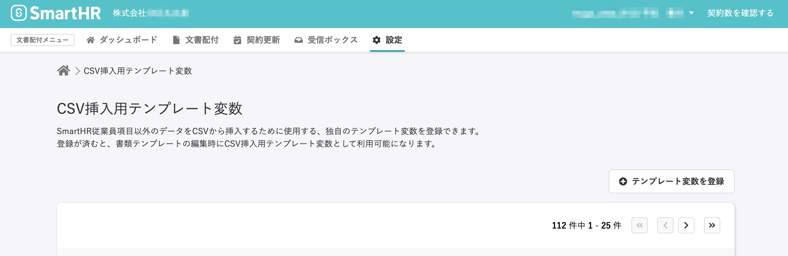
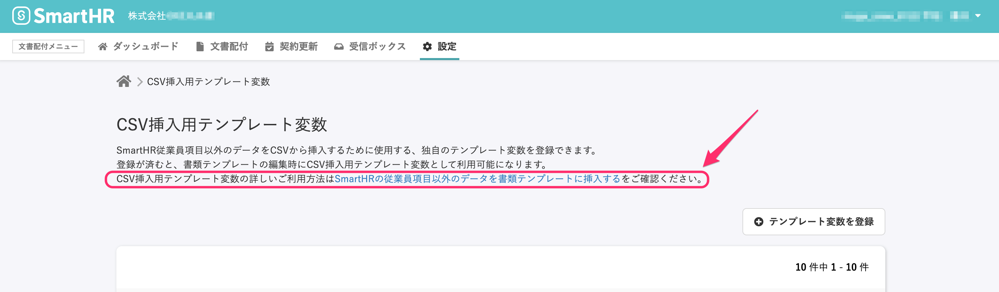

2020年10月1日（木）に行なったアップデートの詳細をお知らせします。

文書配付機能の変更点は、カイゼン1点・不具合修正1点でした。

# 📈 カイゼン

## 「CSV挿入用テンプレート変数」のページに、ヘルプページへのリンクを追加しました

2020/09/30に、SmartHRの従業員項目以外のデータを書類テンプレートに挿入できる「CSV挿入用テンプレート変数」の機能をリリースしました。

:::related
[2020/09/30 合意が要らない書類の作成・配付ができるようになりました 他2件](https://knowledge.smarthr.jp/hc/ja/articles/360054923014)
:::

そのページの説明欄に、関連ヘルプページへのリンクを追加しました。

| 変更前 |  |
| --- | --- |
| 変更後 |  |

新機能の使い方は、ヘルプページをご覧ください。

:::related
[SmartHRの従業員項目以外のデータを書類テンプレートに挿入する](https://knowledge.smarthr.jp/hc/ja/articles/360054592174)
:::

# 👨‍⚕️ 不具合修正

下書き書類の確認に関する1件の不具合修正を行ないました。
