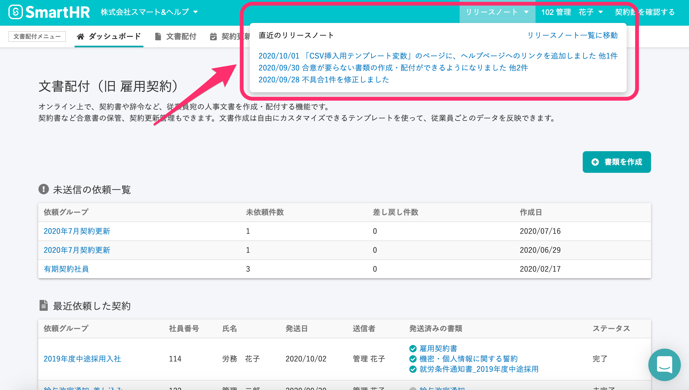

2020年10月2日（金）に行なったアップデートの詳細をお知らせします。

文書配付機能の変更点は、カイゼン1点・不具合修正1点でした。

# 📈 カイゼン

## 文書配付機能のアップデート情報へのリンクを設置しました

ページ上部のヘッダーにリリースノートのメニューを追加し、文書配付機能についての直近3件のリリースノート（※）が確認できるようになりました。

タイトルをクリックすると、その日にリリースされた新機能やカイゼン内容を確認できます。

※リリースノートとは、ソフトウェアの機能のカイゼンや不具合修正などの変更点を簡潔に説明する文書です。

# 👨‍⚕️ 不具合修正

CSVアップロード時にエラーになった際の文言に関する1件の不具合修正を行ないました。
