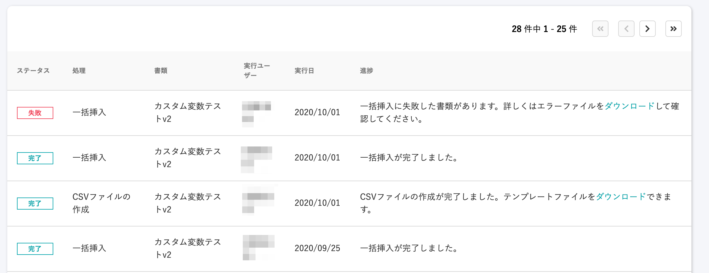
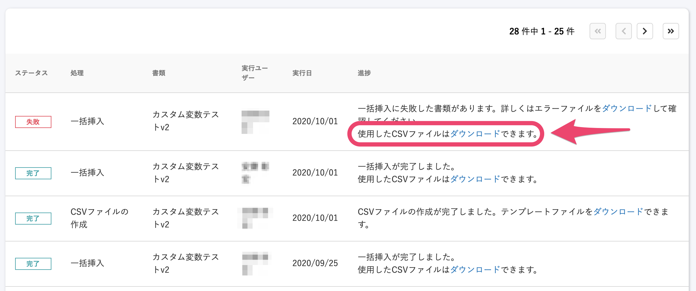

2020年10月5日（月）に行なったアップデートの詳細をお知らせします。

文書配付機能のリリースは、新機能1件、不具合修正2件でした。

# 📈 カイゼン

## 一括挿入でアップロードしたCSVファイルをダウンロードできるようにしました

一括挿入でアップロードしたCSVファイルを、該当する処理の **\[進捗\]** の欄でダウンロードできるようにし、アップロード後にファイルの内容を確認しやすくしました。

| 変更前 |  |
| --- | --- |
| 変更後 |  |

# 👨‍⚕️ 不具合修正

CSV挿入用テンプレート変数一覧の表示に関する修正など、2件の不具合修正を行ないました。
