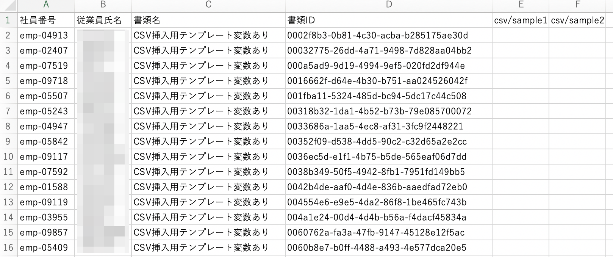
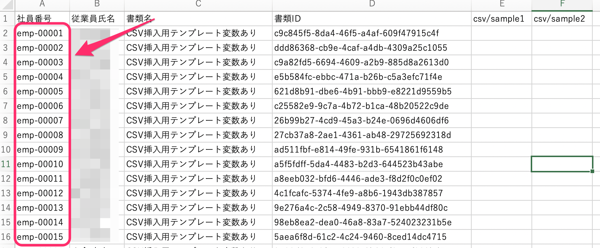
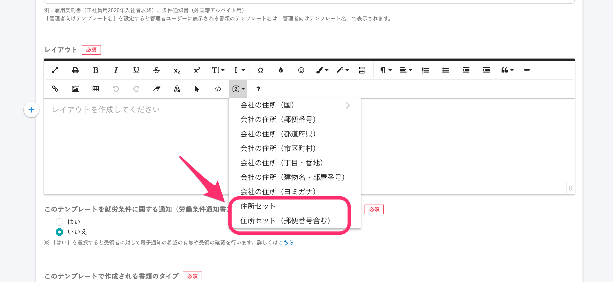
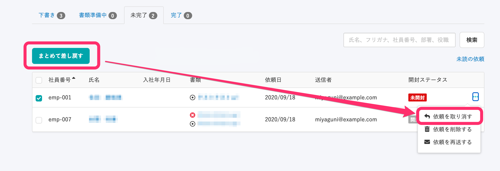
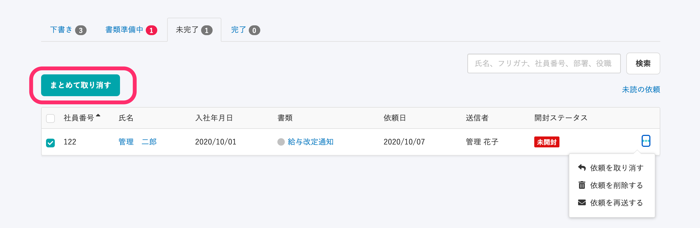
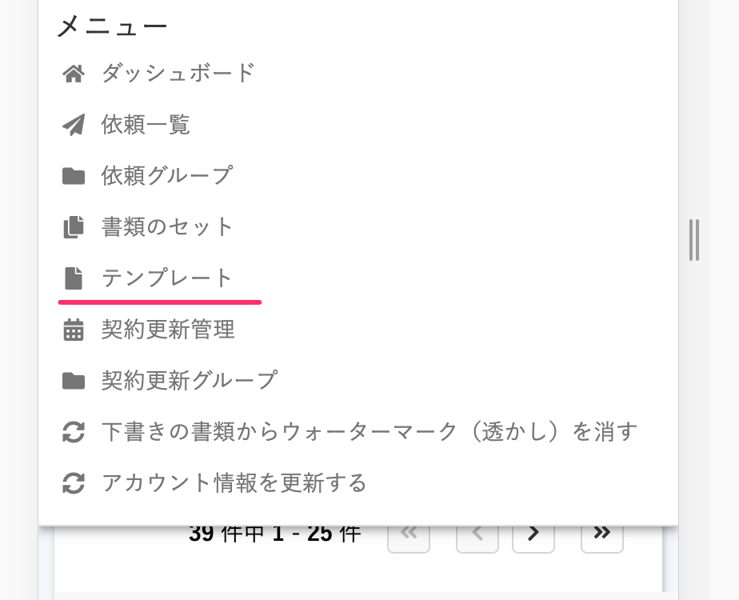
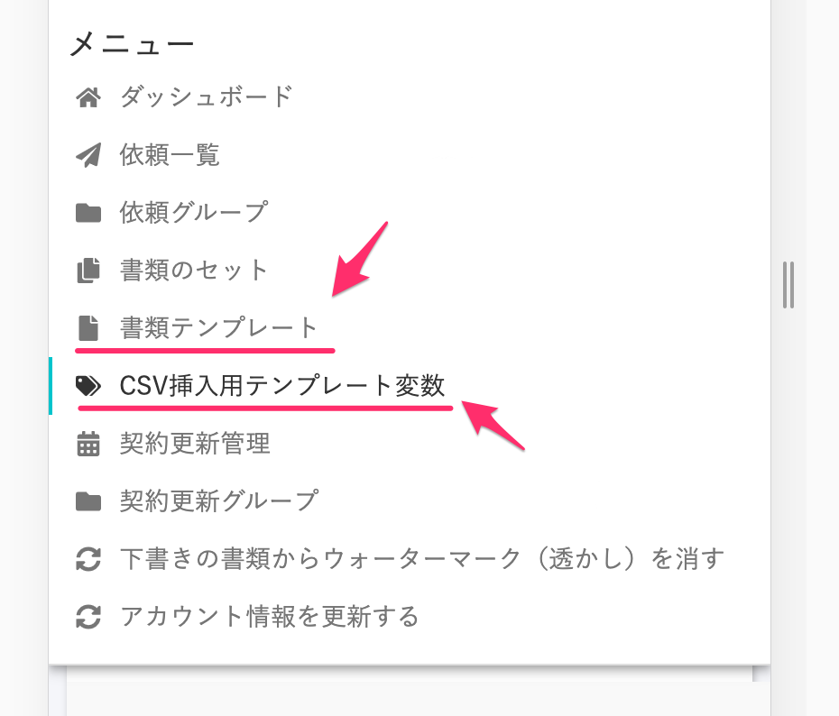
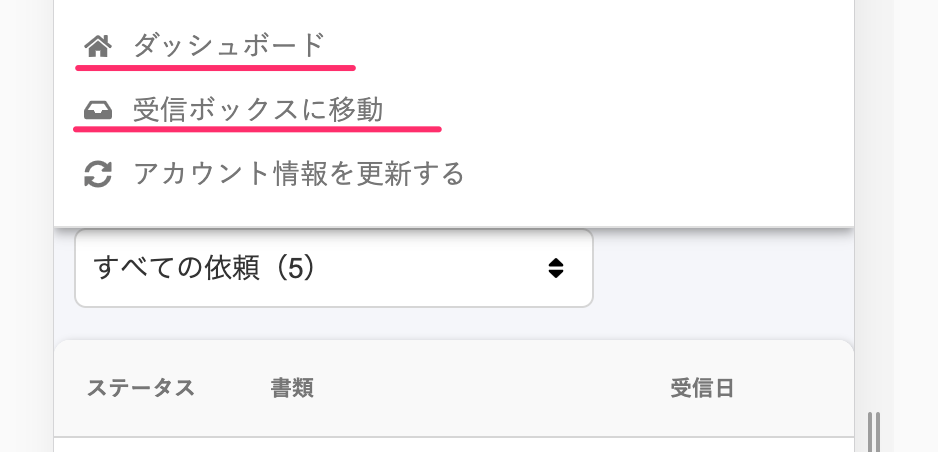
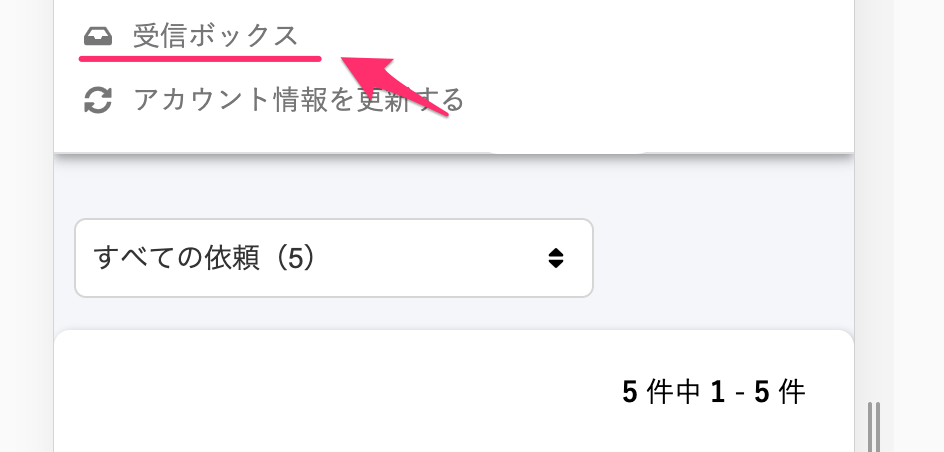
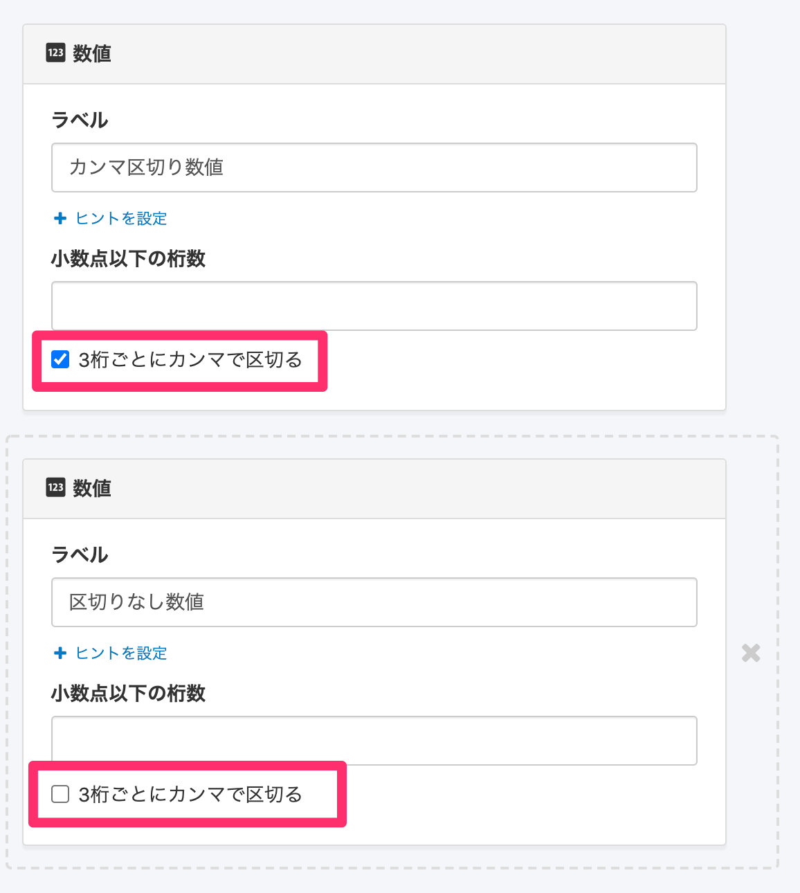

2020年10月6日（火）に行なったアップデートの詳細をお知らせします。

届出書類機能のリリースは、カイゼン4件、不具合修正2件でした。

# 📈 カイゼン

## 一括挿入用変数一覧CSV内の従業員の並びを社員番号順にしました 

CSV挿入用テンプレート変数の一括挿入機能で一括挿入用CSVファイルを作成する際、これまではファイル内の従業員情報の順序が不定でしたが、使い勝手をよくするために社員番号順に並び替えるようにしました。

| 変更前 |  |
| --- | --- |
| 変更後 |  |

## テンプレート変数のメニューに、会社の \[住所セット\] と会社の \[住所セット(郵便番号含む)\] を追加しました

テンプレート変数の差し込みメニューで、会社の **\[住所セット\]** と会社の **\[住所セット(郵便番号含む)\]** を追加しました。

**\[会社\]** > **\[住所\]** から **\[住所セット\] ／ \[住所セット（郵便番号含む）\]** を選択できます。

## \[まとめて差し戻す\] ボタンを \[まとめて取り消す\] に変更しました 

依頼グループ詳細画面の **\[未完了\]** タブ にある、\[まとめて差し戻す\] ボタンの文言を **\[まとめて取り消す\]** に変更しました 。

依頼毎のメニュー内の文言と表記を合わせています。

| 変更前 |  |
| --- | --- |
| 変更後 |  |

## スマートフォンのナビに表示するメニューの文言を変更しました

スマートフォン表示用ナビに表示するリンクメニューの文言を変更しました。

管理者画面と従業員画面に変更があります。

### 1\. 管理者画面

\[テンプレート\] は **\[書類テンプレート\]** に変更し、意味を明確にしました。

**\[CSV挿入用テンプレート変数\]** のメニューを追加しました。

| 変更前 |  |
| --- | --- |
| 変更後 |  |

### 2\. 権限のない従業員画面

\[ダッシュボード\] は不要な表示だったため削除しました。

\[受信ボックスに移動\] は、**\[受信ボックス\]** に変更しました。

| 変更前 |  |
| --- | --- |
| 変更後 |  |

# 👨‍⚕️ 不具合修正

## カスタム項目の数字の \[3桁ごとにカンマで区切る\] の設定を正しく反映するようにしました

これまでは、SmartHRのカスタム従業員項目の設定で **\[3桁ごとにカンマで区切る\]** のチェックを外した項目でも、書類配付機能ではカンマが挿入されている状態でした。

今回の修正で、カスタム従業員項目の設定を正しく反映し、**\[3桁ごとにカンマで区切る\]** のチェックを外した項目は、書類配付機能で差し込んだときにカンマが挿入されないようにしました。

他、ナビゲーションメニューの表示に関する不具合修正を行ないました。
