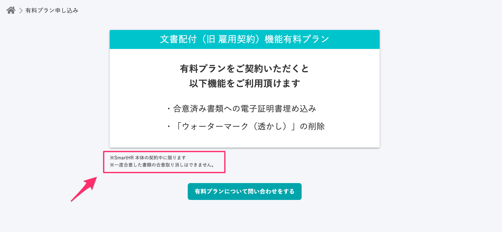
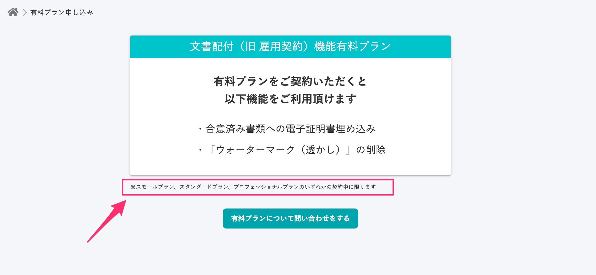
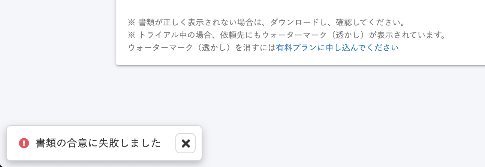
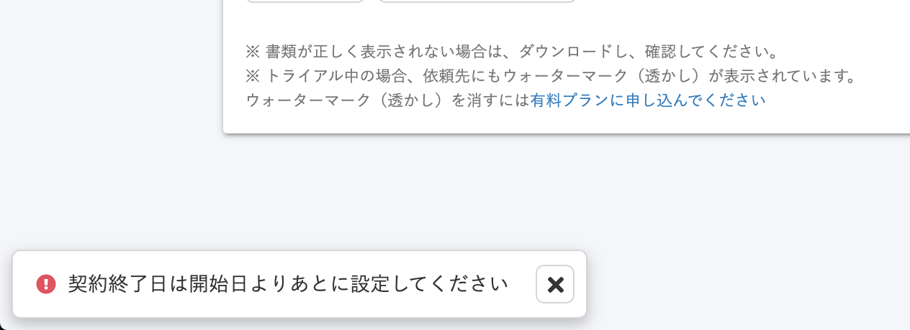

2020年10月9日（金）に行なったアップデートの詳細をお知らせします。

文書配付機能のリリースは、カイゼン2件、不具合修正1件でした。

# 📈 カイゼン

## \[有料プラン申し込み\] の注釈文言を変更しました

文書配付機能有料プランの申し込みの注釈を、 \[SmartHR本体\] という曖昧なものから、 **\[スモールプラン、スタンダードプラン、プロフェッショナルプランのいずれかの契約中に限ります\]** という具体的なものに変更しました。

また、これまで注釈として \[一度合意した書類の合意取り消しできません\] と表記していましたが、合意破棄機能で合意の取り消しができるようになったため、削除しました。

| 変更前 |  |
| --- | --- |
| 変更後 |  |

## 特定の条件で書類の合意しようとした際のエラーメッセージを変更しました

雇用契約情報の **\[契約開始日\]** が **\[契約終了日\]** よりも未来に設定されている状態で従業員が書類に合意しようとした際に表示されるエラーメッセージを **\[契約終了日は開始日よりあとに設定してください\]** に変更しました。

これまでは、上記の条件で表示されるのは \[書類の合意に失敗しました\] という原因が不明瞭なエラーメッセージだったため、原因の特定に時間がかかっていました。

今回の改修で原因を明記したことにより、ユーザーの皆さんに自己解決をしていただいたり、サポートメンバーが原因を特定してご案内したりできるようになりました。

| 変更前 |  |
| --- | --- |
| 変更後 |  |

# 👨‍⚕️ 不具合修正

書類ステータスの表示に関する1件の不具合修正を行ないました。
