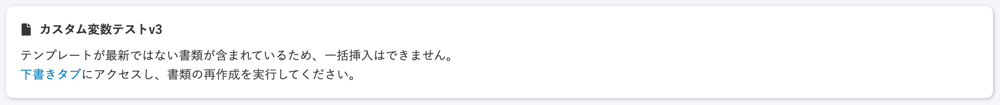

2020年10月12日（月）に行なったアップデートの詳細をお知らせします。

文書配付機能のリリースは、カイゼン1件でした。

# 📈 カイゼン

## CSVの一括挿入ができない場合のメッセージを見やすくしました

CSV挿入用テンプレート変数の一括挿入画面で、一括挿入ができない場合に表示されるメッセージの「フォントサイズを大きく」＆「色合いを濃く」し、わかりやすくしました。

| 変更前 |  |
| --- | --- |
| 変更後 |  |

| 変更前 |  |
| --- | --- |
| 変更後 |  |
