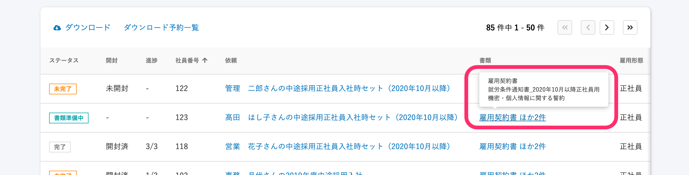

2020年10月13日（火）に行なったアップデートの詳細をお知らせします。

SmartHR基本機能の変更点は、カイゼン1件・不具合修正2件でした。

# 📈 カイゼン

## 差し戻されたあとに再作成された元の書類名は、ツールチップに表示しないようにしました

文書配付機能では、依頼一覧画面で **\[書類\]** の項目にカーソルを合わせると、依頼に含まれている書類名がツールチップで表示される仕様になっています。

この部分で、これまでは、「差し戻し」→「再作成」した場合に、差し戻した書類の名前も表示されており、実質同じ書類が複数表示されてしまっていました。

今回のカイゼンで、再作成した場合は差し戻し前の元の書類名は表示せず、再作成後の書類名のみ表示するようにしました。

# 👨‍⚕️ 不具合修正

書類作成失敗時のエラーメッセージに関する修正など、2件の不具合修正を行ないました。
