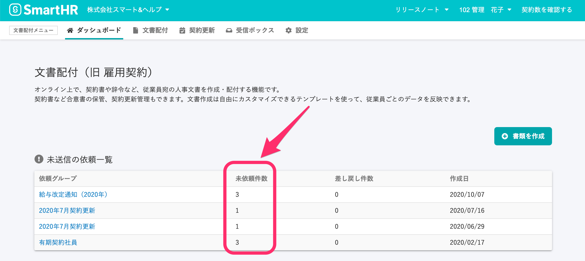

2020年10月14日（水）に行なったアップデートの詳細をお知らせします。

文書配付機能のリリースは、カイゼン1件でした。

# 📈 カイゼン

## 依頼グループの \[未依頼件数\] としてカウントする対象を「下書きに存在する依頼数」に変更しました

ダッシュボードと依頼グループ一覧に表示される依頼グループの **\[未依頼件数\]** は、これまでは「依頼可能な依頼数」を表示していましたが、今回のカイゼンで、差し戻された依頼を除いた「下書きに存在する依頼数」を表示するようにしました。

この変更により、以下の2つのことがわかるようになっています。

- 作成した依頼の中に未対応の書類がないか確認できるようになりました
- 作成に失敗したりCSV挿入が終わってない「依頼がまだできていない書類」も未依頼として把握できるようになりました
