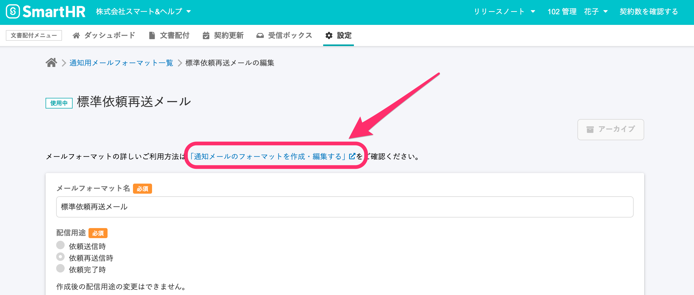
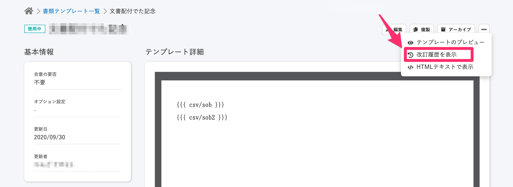
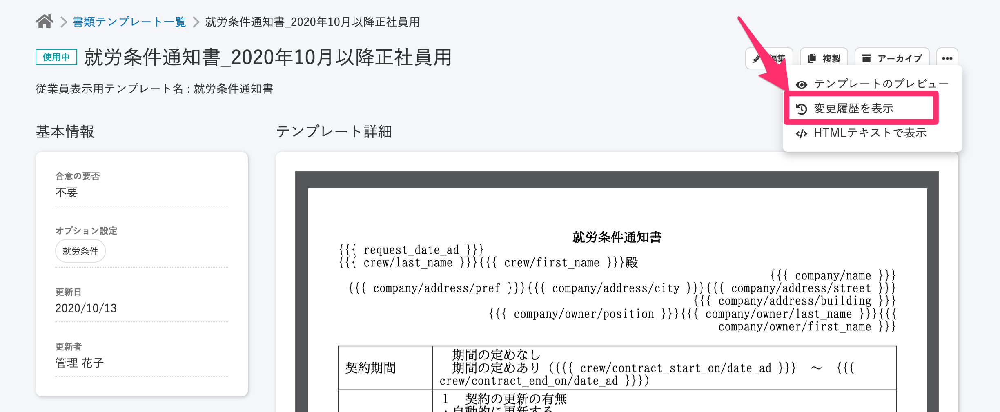
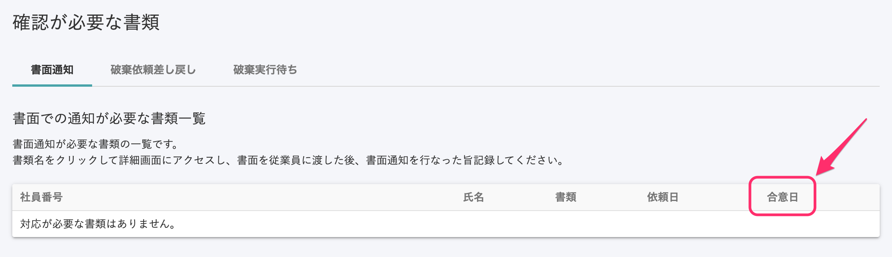
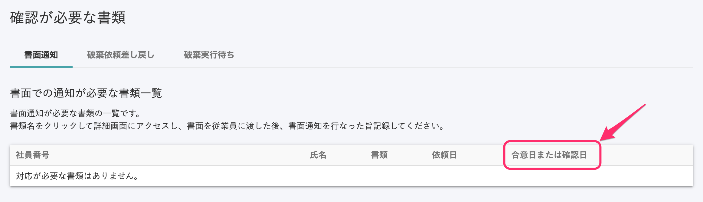
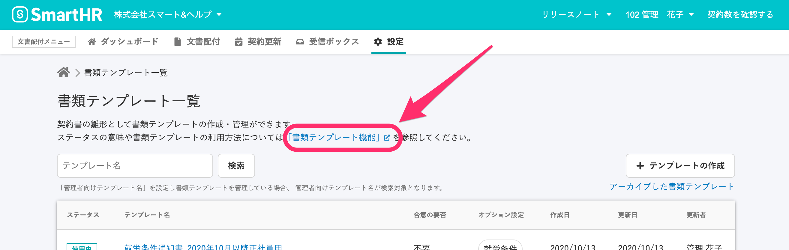

2020年10月16日（金）に行なったアップデートの詳細をお知らせします。

文書配付機能のリリースは、カイゼン3件、不具合修正1件でした。

# 📈 カイゼン

## ヘルプページへのリンクの文言を変更しました

雇用契約機能を文書配付機能としてリニューアルしたことを反映し、メールフォーマット編集画面のヘルプページへのリンクを下記の文言に変更しました。

変更前： \[雇用契約機能のフォーマットを作成・編集する\]
変更後： **\[通知メールのフォーマットを作成・編集する\]**

## メニュー内にある \[改訂履歴\] を \[変更履歴\] に変更しました

プロダクト内で共通で使われている文言にするため、書類テンプレート詳細画面の三点リーダーにあるメニュー表記を\[改訂履歴\] から **\[変更履歴\]** に変更しました。

| 変更前 |  |
| --- | --- |
| 変更後 |  |

## \[合意日\] を \[合意日または確認日\] に変更 しました

文書配付機能リリースにより合意が要らない文書も混在するようになったため、確認が必要な書類一覧の \[合意日\] を **\[合意日または確認日\]** に変更しました。

| 変更前 |  |
| --- | --- |
| 変更後 |      |

# 👨‍⚕️ 不具合修正

## ヘルプページへのリンクを別タブで開くよう修正しました

書類テンプレート一覧画面上部にある、 **「書類テンプレート機能」** のヘルプページへのリンクが別タブで開かないようになっていたため、修正しました。

