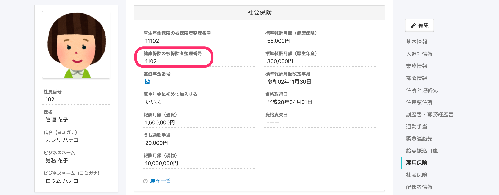
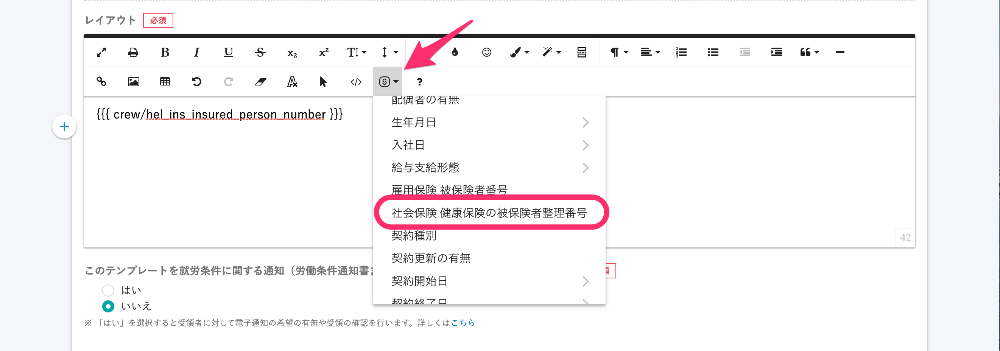

2020年10月19日（月）に行なったアップデートの詳細をお知らせします。

届出書類機能のリリースは、カイゼン1件でした。

# 📈 カイゼン

## テンプレート変数として 「社会保険 健康保険の被保険者整理番号」 を挿入できるようにしました

資格証明書などを作る際にテンプレート変数として利用できると便利なため、「社会保険 健康保険の被保険者整理番号」が挿入できるようしました。

**\[社会保険 健康保険の被保険者整理番号\]**

**\[SmartHRのデータを挿入する\]** マークから **\[従業員\] >** **\[社会保険 健康保険の被保険者整理番号\]** を選択すると変数を挿入できます。

:::related
[テンプレート変数を使って書類テンプレートを作成する](https://knowledge.smarthr.jp/hc/ja/articles/360036818773)
:::
