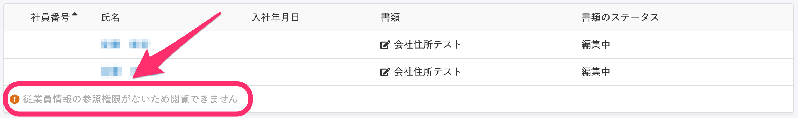
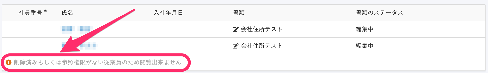

2020年10月20日（火）に行なったアップデートの詳細をお知らせします。

文書配付機能のリリースは、カイゼン1件でした。

# 📈 カイゼン

## 従業員を閲覧できない理由を説明する文言を変更しました

これまでは、依頼グループ詳細画面に含まれる従業員が削除されていた場合、管理者権限では **\[削除済み従業員\]** と表示されている一方で、カスタム権限では **\[従業員情報の参照権限がないため閲覧できません\]** と表記されており、なぜ参照できないかの説明として不正確な状態になっていました。

そのため、従業員情報が削除された可能性も考慮し、閲覧できない従業員がいた場合に表示する文言を **\[削除済みもしくは参照権限がない従業員のため閲覧出来ません\]** に変更しました。

| 変更前 |  |
| --- | --- |
| 変更後 |  |
