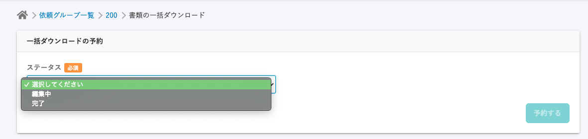
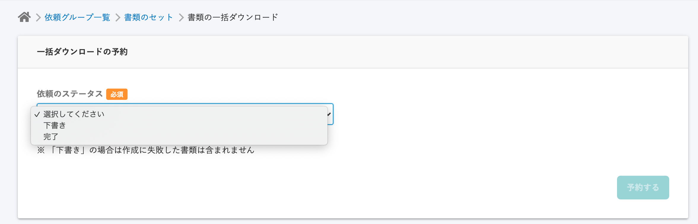

2020年10月21日（水）に行なったアップデートの詳細をお知らせします。

文書配付機能のリリースは、不具合修正1件でした。

# 👨‍⚕️ 不具合修正

## 書類の一括ダウンロード画面の文言の変更とメッセージの追加をしました

書類の一括ダウンロード画面の文言を下記のように変更しました。

- **\[ステータス\]** → **\[依頼のステータス\]** に変更

文書配付機能の中には「書類のステータス」と「依頼のステータス」の2つのステータスがあるため、どちらのステータスなのかを明記することでわかりやすくする目的です。

また、ステータスの選択肢も変更しています。

- **\[編集中\]** → **\[下書き\]** に変更
- **\[※ 「下書き」の場合は作成に失敗した書類は含まれません\]** という注意書きを追記

こちらは、 **\[下書き\]** タブに表示されている書類が対象であることと、作成に失敗した書類は対象外であることを明確にすることが目的です。

| 変更前 |  |
| --- | --- |
| 変更後 |  |
