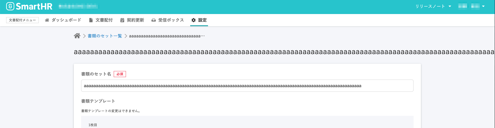
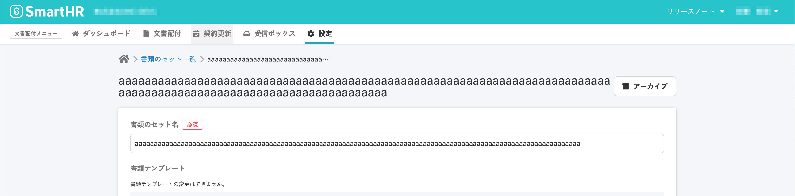

2020年10月21日（木）に行なったアップデートの詳細をお知らせします。

文書配付機能のリリースは、不具合修正1件でした。

# 👨‍⚕️ 不具合修正

## タイトルが英字のみで長文の場合のレイアウトを整えました

書類セットや書類テンプレートの各画面で、英字のみで長文の場合にタイトルレイアウトが崩れてしまっていたので、今回の改修で整えました。

**\[書類セット編集画面\]**

| 変更前 |  |
| --- | --- |
| 変更後 |  |
